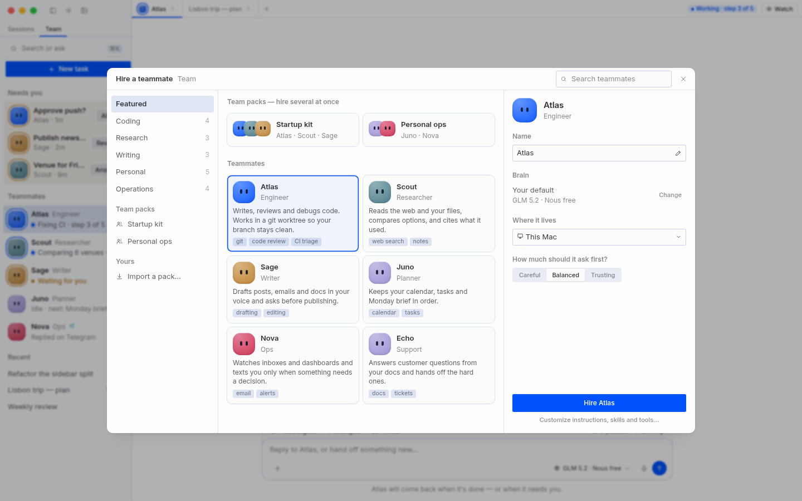
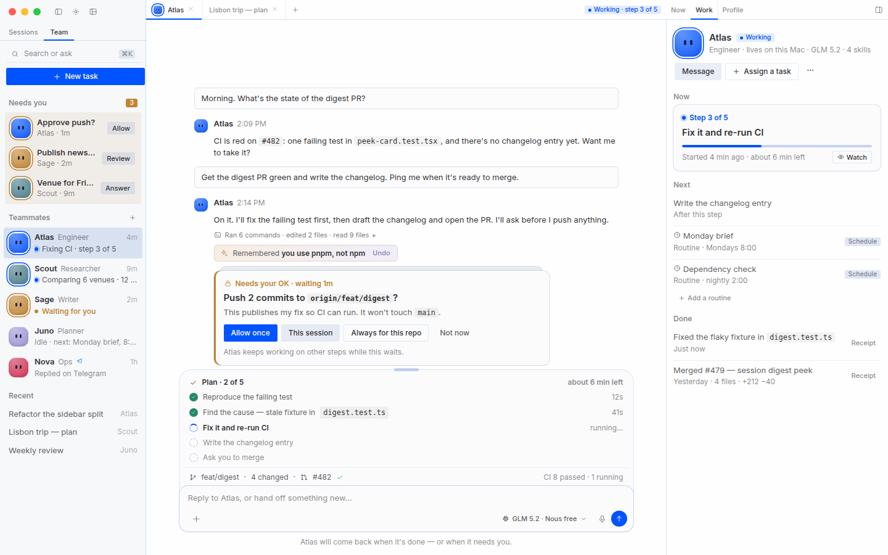
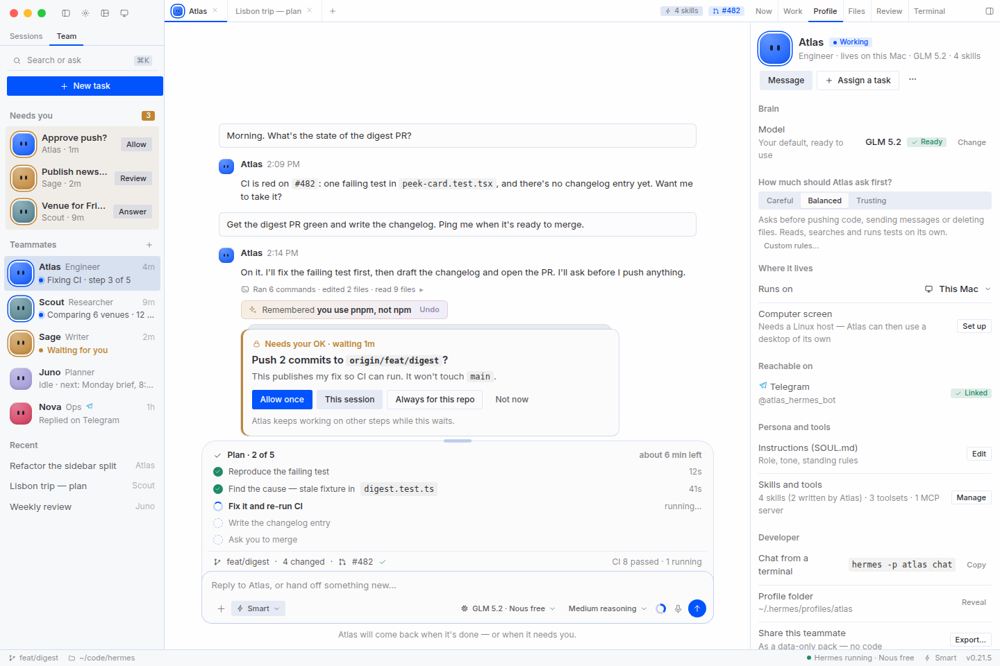

# Wave B — Bot Mode becomes **Teammates**: easy for everyone, complete for developers

The flagship surface of the desktop. Bot Mode today has real power — a live computer screen with Take over / Hand
back, routines, group rooms, task hand-offs, cross-machine messaging — but it is **hard to navigate and not
pleasant to look at**. This plan fixes navigation and looks inside the current app (Simple / Advanced modes, the
plugin seams, the token pipeline), adds features that help both everyday users and developers, and lays out how
the plugin is packaged and deployed.

Read with [`revamp-visual-plan.md`](./revamp-visual-plan.md) (Wave V: tokens, modes, error system — Wave B builds on
it) and [`revamp-plan.md`](./revamp-plan.md) (upstream one-gateway cutover). Targets are rendered from the app's
real tokens in [`revamp/mockups/png/`](./revamp/mockups/png/).

> **How I read "how we deploy it".** Two things, both covered: **(1)** how the *plugin* is packaged, versioned and
> distributed (§7) and **(2)** how a *teammate* is deployed — where it lives, how it's shared (§6 B6/B8). If you
> meant the desktop app's own release pipeline, say so and I'll add it.

| Hire a teammate | Teammate panel — Work (Simple) |
|---|---|
|  |  |

---

## 1. Bot Mode today (verified)

- A **bundled desktop plugin**: `src/plugins/hermes-bots/` — **76 source files, ~31k lines** (largest: `i18n.ts` 2,388,
  `group-chat.ts` 1,897, `group-chat-view.tsx` 1,551, `data.ts` 1,513, `group-turns.ts` 1,431, `create-dialog.tsx`
  1,368, `cron.tsx` 1,346, `avatar.tsx` 1,157). Discovered by `discoverBundledPlugins()`; **on by default**;
  live-toggleable at *Capabilities → Plugins → Bots* (roster, Routines pane and composer middleware unregister
  without a restart). It never owns data — a **Bot is a Hermes profile**.
- **The renderer half is already SDK-only:** **0 of 76** non-test source files import core internals (`@/…`); 60
  import `@hermes/plugin-sdk`, and it feature-detects newer SDK exports. That is what makes extraction (§7) feasible.
- The **backend half lives in core**: `tools/bot_*.py` (`bot_desktop/`, `bot_mailbox`, `bot_relay`,
  `bot_live_delivery`, `bot_mode_dm`, `bot_mode_probe`, `bot_failure_reasons`), `tui_gateway/methods_bot_mailbox.py` +
  `methods_bot_relay.py`, `hermes_cli/profiles.py` (`export_profile`/`import_profile`), the agent-side
  `agent.bot_mode_protocol` prompt section and `message_agent` tool.
- **Capabilities:** roster with sections and per-gateway groups; canonical **Bot Chat** ("forever chat", identified
  by the exact title `Bot Chat`); avatars (blob faces, geometric, upload, AI portrait, pixel pet); per-bot voice;
  **Routines** (cron jobs named `[bot:<name>] …`); group rooms (2–6 bots, rounds, durable driver, cross-machine);
  bot-to-bot `@mentions` and `message_agent`; a **Screen** (live view of a bot's headless desktop, Take over /
  Hand back, `ScreenInstallCard`); "Create on" another connection; task mailbox; `hermes peer` cross-gateway DMs;
  warm-backend pool.
- **Invariants that stay untouched** (`src/AGENTS.md`): one bot = one canonical chat, identified by *name*; no
  session-id pointer; recency never picks the target; no per-bot session browser; canonical chats stay hidden from
  the Sessions sidebar.

## 2. Why it's hard to navigate and not pretty

**Navigation sprawl — a bot's "home" is spread across at least 13 entry points:**

| # | Entry | Code |
|---|---|---|
| 1 | **Bots tab** roster (sections, gateway groups, filter menu, 4 toolbar icons) | `agents-section.tsx`, `bot-row.tsx`, `roster-pane-toolbar.tsx` |
| 2 | **Bots pane** (a second roster) | `plugin.tsx` `id:'pane'` → `roster-pane*.tsx` |
| 3 | **Routines pane** — docks only while the Bots tab is active; "closing hides it until you leave and re-enter" | `plugin.tsx` `registerRoutinesPane`, `cron.tsx` |
| 4 | **19-item context menu** | `bot-row.tsx` |
| 5 | **Right-sidebar bot panel** (Task log · Sessions · Computer · Scheduled jobs · Deliverables) | right zone |
| 6 | **Screen** as a centre tab | `screen-pane.tsx`, `screen-open.tsx`, `screen-portal.tsx` |
| 7 | **Group rooms** — their own view (gear, people icon, Activity, threads) | `group-chat-view*.tsx` |
| 8 | **`/agents`** and **`/roster`** overlays (core) | `app/agents`, `app/roster` |
| 9 | **⌘K** entries `new-agent`, `agents` | `plugin.tsx` (`PALETTE_AREA`) |
| 10 | **Create dialog** (3 fields + an Advanced disclosure of ~8 more) | `create-dialog.tsx` |
| 11 | **Edit Profile** dialog | `edit-profile-dialog.tsx` |
| 12 | **Assign task** (mailbox) | `mailbox*.ts(x)` — broken (F2) |
| 13 | **Settings** (Warm Bot Backends, idle timeout) and *Capabilities → Plugins → Bots* | `settings/pool-limits-setting.tsx` |

**Concept overload.** The user guide (381 lines) puts *canonical Bot Chat, gateway groups, sections, `@name-device`,
relay, peers, capability epoch, room authority promote/demote, warm backends* on one page. An everyday user needs
maybe five ideas; a developer needs the rest — but both meet all of it in the same UI.

**Dead ends and looks** (recording, F1–F10 in Wave V): a bot with no model looks ready; *"No bot screen on this
host"* as a centre canvas; five empty panels; a 19-item menu; tiny grey labels; a `Smart` pill nobody can read.

## 3. Principles

1. **One home per teammate.** Chat in the centre; everything *about* the teammate in one right-zone panel
   (**Now · Work · Profile**, + **Screen** when set up). Every other entry point becomes a link into it.
2. **Simple and Advanced are the app's own modes** — same resolver, same `tier`/`shownInMode`/`ModePolicy`
   machinery. Bot Mode adds *no* mode of its own.
3. **Hide what can't apply; explain what can.** Unavailable capabilities disappear (or become one honest "Set up"
   row) — they are never a canvas that says "not available".
4. **Share teammates as data, never code** (§7.5).
5. **Stay a plugin.** No core edits for Bot Mode UX; widen the generic plugin surface if a seam is missing
   (root rubric: *plugins work within the ABCs/hooks we provide; if one needs more, widen the surface*).
6. **Cutover-safe.** Relay, mailbox admission, room driver, warm pool and screen transport are exactly what the
   one-gateway cutover moves — isolate them behind one adapter (§7.3).
7. **Say "Team" in the UI** (gate G8); the plugin, profiles and Bot Chat identity rules keep their names.

## 4. Information architecture v2

```
Sidebar:  Sessions | Team                         Team = Needs you · Teammates · Rooms · Recent
Click a teammate →  Chat (centre)   +   Teammate panel (right zone, rests closed in Simple)
                                          ├─ Now      what it's doing, live, replayable, Take over
                                          ├─ Work     Now / Next (queued + routines) / Done (receipts)
                                          ├─ Profile  Brain · Trust · Where it lives · Reachable on
                                          │           [Advanced] Instructions · Skills/tools · Developer
                                          └─ Screen   only once "Give it a computer" is set up
⌘K          Hire a teammate · Assign a task · Ask everyone · Schedule …
```

| Today (13 entries) | v2 |
|---|---|
| Bots tab + Bots pane + `/roster` | **Team** tab (one list) + Mission Control *Running* lens |
| Routines pane (docks/undocks) | **Work › Next** (+ "Add a routine"); Advanced keeps the cron-expression field |
| Right-sidebar bot panel | **Teammate panel** tabs |
| 19-item menu | **6 + More**: Message · Assign a task · Open panel · Pin · Edit · **More ▸** (Watch, Notifications, Groups, Model, Duplicate, Export, Move to section, Delete) |
| Screen as a centre tab | **Screen** tab in the panel; centre tab remains for full-size |
| `/agents` | Mission Control *Running* → subagent tree |
| Create dialog + Edit Profile | **Hire** front door; *Customize…* opens today's dialog; Edit = Profile tab |
| Group rooms | **Rooms** rows in the same list (Advanced by default; shown in Simple once one exists) |
| Warm-backend settings | Advanced settings; would disappear if the open one-gateway PR lands as diffed (it deletes `store/pool-limits.ts`) |

## 5. Simple vs Advanced inside Bot Mode

| | **Simple** — "for talking to Hermes" | **Advanced** — "for developers" |
|---|---|---|
| Team | Needs you · Teammates · Recent; faces + a live sentence | + Rooms, sections, gateway/connection groups, profile rail |
| Hire | Gallery → name, brain, where, trust → **Hire** | + Customize: SOUL, skills, toolsets, MCP, clone source, keys |
| Panel | Now · Work · Profile | + Files · Review · Terminal panes |
| Profile | Brain · **Trust** · Where it lives · Reachable on | + Instructions (SOUL.md) · Skills & tools · **Developer** (CLI, folder, export, logs) |
| Tasks | Assign a task (outcome, check-in) | + task payloads, mailbox status |
| Screen | Watch · Take over | + install diagnostics, lease, host details |
| Errors | one card, one fix | + Details, raw error, CLI hint |
| Rooms / relay / peers | hidden until used | visible; room authority ops stay docs-only (operator recovery) |



## 6. Features that help everyone (B1–B12)

"Who" = **E**veryone · **D**evelopers. "Seam" is where it plugs in today. Every item is renderer-first; anything
that needs backend work is flagged **⚙** (fork backend — will be re-homed at the upstream sync).

| # | Feature | Who | Spec | Seam / notes | Tier |
|---|---|---|---|---|---|
| **B1** | **Hire a teammate** | E | A gallery of role templates (Engineer, Researcher, Writer, Planner, Ops, Support) and **Team packs**; pick → name → brain → where → trust → *Hire* in ~30 s. Default brain = **"start from my setup"** (the sanctioned `--clone` path; profiles stay islands). Templates are bundled *data*. | replaces the front of `create-dialog.tsx`; `PALETTE_AREA` `new-agent` | S · A(+Customize) |
| **B2** | **Brain doctor** | E | A new bot's usable auth is *verified*, not assumed. Docs: only static API keys are copied; OAuth/free-tier aren't. If no brain: **"Give ‹bot› a brain"** — free tier / sign in / choose model, all in-app, profile-scoped (`?profile=`), reusing `free_tier.*` and `POST /api/providers/oauth/<p>/start`. Shares the `no_provider_configured` card. | fixes F1/F3; `free-tier/*`, `providers-settings` | S · A |
| **B3** | **Work: Now / Next / Done** | E | Live sentence + progress (Now); queued tasks + routines (Next); receipts with **no session browser** (Done). Replaces Task log / Sessions / Computer / Scheduled jobs / Deliverables. | right-zone bot panel; `store/session-digest`, todos, `cron.tsx` | S · A |
| **B4** | **Assign a task, done right** | E · D | Outcome, optional deadline, check-in cadence; the result lands as a card in *both* chats. **Fix F2 first.** "Ask everyone" (today's *Broadcast to bots…*) and "Schedule" (today's *Routines calendar…*) get real labels in the Team header and ⌘K. | `mailbox*.ts`, `methods_bot_mailbox.py` ⚙ | S · A |
| **B5** | **Trust dial** | E · D | *Careful / Balanced / Trusting* = `approvals.mode` **manual / smart / off** — already **profile-scoped and backend-synced** (`store/approval-mode.ts`, `approval-mode-menu.tsx`), so per-teammate for free. *Trusting* asks for one confirmation and is never a default. Advanced: "Custom rules…" (per-pattern *Always* allow-list). No new policy engine. | `approvals.mode` | S · A |
| **B6** | **Where it lives + Give it a computer** | E · D | *Runs on*: This Mac / a registered connection (today's *Create on*). *Computer screen*: probe the host **before** showing anything — Linux gateway host required; if absent, one **Set up** row (never a dead canvas); if present, the existing `ScreenInstallCard` flow. Row thumbnails via `screen-hero`/`thumbnail.py`. | `screen-install.tsx`, `screen-state.ts`, `tools/bot_desktop/` | S · A |
| **B7** | **Reachable on** | E | Per-teammate messaging status with badges (Telegram/Slack/…), **Create with QR** promoted from Settings, *Continue on phone* promoted from the menu. | messaging settings; mobile companion (#73) | S · A |
| **B8** | **Team packs** | E · D | Export/import a teammate or group as a **data-only pack** (§7.5): SOUL.md + config subset + routines + *skill references*, previewed and consented on import. Built on `export_profile`/`import_profile` (credentials already dropped, text secret-scrubbed) but **allow-listed** — not a raw profile archive. | `hermes_cli/profiles.py` ⚙ (moving to `profiles/` in #122491) | S (import) · A (author) |
| **B9** | **Health check** | E · D | "Check Atlas": brain, credentials, gateway, backend slot, screen, routines → the same one-problem-one-card fixes. Replaces the ⚠ badge piles. | error system (Wave V) | S · A |
| **B10** | **What Atlas knows** | E · D | Per-teammate memory + self-written skills + curator timeline with Undo (Wave V H1/H2). The one thing no other harness can show. | memory tool rows; `agent/curator.py` state | S · A |
| **B11** | **Briefs & heartbeats** | E | One-click routine blueprints per teammate ("Morning brief", "Check my PRs hourly"), delivered to desktop *and/or* a messaging platform. Built on cron, no new feed. | `cron.tsx` blueprints | S · A |
| **B12** | **Developer kit** | D | *Developer* section: `hermes -p <bot> chat` (copy), reveal profile folder, export, logs, per-teammate usage/cost, "open in terminal". | Profile tab (Advanced) | A |

**Rooms** (group chats) keep their behaviour and identity rules; v2 only re-homes them as rows in the Team list
and simplifies the header. Rooms, mailbox status, relay and peers stay Advanced until a room or peer exists.

## 7. The plugin and how it's deployed

### 7.1 What the platform gives us (verified)
- **Bundled plugins:** `src/plugins/<name>/plugin.tsx`, auto-discovered; same inventory and live enable/disable
  contract as runtime plugins.
- **Runtime plugins:** ESM loaded from `$HERMES_HOME/desktop-plugins/<name>/plugin.js` or the *unified agent-plugin*
  layout `<hermes home>/plugins/<name>/desktop/plugin.js`; import allowlist (`@hermes/plugin-sdk`, `react*`).
  **It is not a security boundary** — a loaded plugin runs with the app's full authority; isolation is *error*
  isolation only (`contrib/runtime-loader.ts`).
- **Catalog:** `plugin-catalog/*.yaml` — human-merged PR, **40-char SHA pin**, declared `capabilities:` that must
  match reality, install scanner at admission, **no self-updating code**, desktop plugins **SDK-surface only**
  (`hermes plugins validate` → `plugin_validate_desktop.py`), install via `hermes plugins install <name>`,
  update via SHA-bump PR + `hermes plugins update`.

### 7.2 Options

| | A. Bundled + modular (recommended now) | B. Official catalog plugin (unified: Python half + `desktop/plugin.js`) | C. Standalone repo |
|---|---|---|---|
| Ships with | desktop release | `hermes plugins install bot-mode` | author's repo |
| Updates | with the app | SHA-bump PR + `hermes plugins update` | author-controlled (no self-update in catalog) |
| First-run experience | ✅ works out of the box | needs install or "default-installed" bundle | worst |
| Core narrowness (root rubric) | ⚠ stays in core tree | ✅ capability at the edge | ✅ |
| Backend half | stays in core | must become a Python plugin (`tools/bot_*`, `methods_bot_*`, `agent.bot_mode_protocol`, `message_agent`) | same |
| Risk | none new | large: agent-side hooks + gateway methods must be expressible as plugin surface; conflicts with #122491 + one-gateway | highest |

**Recommendation.** Do **A** now, but *structure it so B is a packaging change, not a rewrite* — the renderer half is
already SDK-only, so the real work is the modular split (§7.3) and a documented backend seam. Take **B** to the
maintainers as gate **G11** *after* the one-gateway cutover lands; both #106742 and #122491 are moving exactly the
backend pieces B would depend on (profiles, gateway control, the `tui_gateway` surface). The upstream root
rubric prefers "plugin over core", so this is their call, not ours.

### 7.3 Modularize (refactor-first, behaviour-neutral)
The repo rule: a file past ~2,000 lines is split along `<stem>_<topic>` **first, in its own commit**; new behaviour
goes in topical siblings, never appended to a facade. For `hermes-bots`:

| Module | Contents | Registers as |
|---|---|---|
| `core` | roster, Bot Chat identity, avatars, create/hire, profile, Work/Profile panel | always |
| `routines` | `cron.tsx` → schedule picker, blueprints | on with core |
| `groups` | rooms, rounds, turns, drivers | Advanced tier, or once a room exists |
| `screen` | screen pane/install/state/portal | on when a host supports it |
| `mailbox` | task hand-offs, cards | on with core |
| `relay` | cross-connection delivery, peers | Advanced tier, or once a connection exists |
| `transport` (**adapter**) | everything the one-gateway cutover changes: relay drain, screen connection, pool limits, room driver calls | internal seam |

Each module registers through its own `ctx.register` group with a `tier`, so Simple loads the minimum and the
*Capabilities → Plugins → Bots* switch can grow per-module switches later. Split order (largest first, each its own
PR): `i18n.ts` → per-locale files; `group-chat.ts`; `data.ts`; `group-chat-view.tsx`; `create-dialog.tsx`;
`cron.tsx`; `avatar.tsx`. `plugin.tsx` (947 lines) becomes a thin composer of module registrations.

### 7.4 Versioning and distribution
- Declare `requires_hermes` and an SDK level (the catalog schema already has `requires_hermes`); keep the plugin's
  *feature-detect* pattern for newer SDK exports so it runs on older desktops.
- **Bundled:** ships and updates with the desktop. **Catalog (if B):** SHA pin; updates only by reviewed bump —
  never a self-updater (catalog rule 3).
- Contract tests for the plugin as a product: register/unregister leaves **zero** UI; each module mounts only in its
  tier; disabled = the app is byte-identical; per-mode layout memory unaffected; runs against `dev:mock`.

### 7.5 Team packs — share teammates as **data, not code**
A desktop plugin runs with full app authority, so every shareable thing that *is* code needs catalog-grade review.
Teammates should not: a pack is **declarative**.

| A pack contains | A pack never contains |
|---|---|
| `pack.yaml` (name, version, teammates, requires) · per-teammate title/description/role · **SOUL.md** · config subset (model *preference*, toolsets, `approvals.mode`) · routines (`[bot:<name>]` cron specs) · **skill references** (hub ids) and *pure-markdown* skills | credentials (`auth.json`, `.env`, `bot-desktop/`) · sessions, memories, `state.db`, logs · executables or skill `scripts/` · JS/Python · absolute paths |

- **Import = preview + consent:** list every file and routine, every skill to be installed (from the hub's own
  trust/scan path — verify what exists), what it will run on a schedule; nothing installs silently.
- Reuse `export_profile`'s credential drop and secret scrub, but export through an **allow-list**, not the raw
  tarball (it also carries binary DBs and any `.py/.sh/.js`).
- Sharing: a file, a link, or a GitHub repo. A curated **pack shelf** in the catalog is a later, maintainer-gated
  step (G12). **Moving a teammate between machines** = export pack + import on the target — honest about no live
  migration.

### 7.6 Deploying a teammate
*This Mac* (default) · a registered **connection** (SSH / URL / Cloud — today's *Create on*) · **+ a computer**
(Linux gateway host → Screen). The panel's *Where it lives* is the one place to see and change this; the Team
list shows a small host badge when a teammate isn't local. If the open one-gateway PR (#106742) lands as diffed, "warm backends" go away
and *where it lives* is simply which gateway owns the profile.

## 8. Execution plan (Devin)

Cutover-safe (`revamp-plan.md` §2.4). Max 3 children (`swe-2-high`). **Refactors are separate, behaviour-neutral
PRs and come first in any file a feature will touch.**

| Wave | PRs | Depends on |
|---|---|---|
| **B0 — P0s** (with V0) | mailbox fix + real-dispatch test · `no_provider_configured` code end to end · demo fixture | — |
| **B1 — split** | the §7.3 splits, largest first; **no behaviour change**; shape metrics before/after | B0 |
| **B2 — navigation** | Team tab · teammate opens chat + panel · menu 19 → 6+More · Routines pane → Work›Next · header actions (*Ask everyone*, *Schedule*) · palette | V2, B1 |
| **B3 — Hire + brain** | B1 gallery · B2 brain doctor · "start from my setup" · Create on | B1, V0(b) |
| **B4 — panel** | B3 Work · Profile (tiered) · B5 trust dial · B6 where/computer · B7 reachable · B9 health | V2, B2 |
| **B5 — tasks** | B4 assign v2 + result cards · B11 briefs | B0, B4 |
| **B6 — packs** | B8 export/import + preview + bundled starter packs · B10 what it knows | B3 |
| **B7 — modules & packaging** | module switches; `transport` adapter; contract tests; **G11** proposal | B1–B6 |

Acceptance for every PR: Wave V §6.1 evidence (Simple/Advanced × light/dark × 3 skins, golden-path recording **with
a working model**, side-by-side against the mockup, sad-meter) **plus** the Bot Mode identity contract tests
(`canonical-chat-registry`, `canonical-chat-creation`, `canonical-chat-adopt-on-conflict`,
`bot-row-opens-canonical-chat`, `hide-bot-chats`, `tests/tui_gateway/test_profiles_list_canonical_session.py`) stay
green.

## 9. Owner decision gates

- **G8 — Naming.** "Bots" → **Teammates**/**Team** in user-facing copy only. *Recommend yes.*
- **G11 — Distribution path.** A now; propose B after the one-gateway cutover. *Recommend yes.*
- **G12 — Packs.** Data-only format (§7.5); **who curates the bundled templates and starter packs** (they're product
  content: roles, prompts, skills); whether a catalog "pack shelf" is worth proposing upstream.
- **G13 — Trust dial semantics.** Careful/Balanced/Trusting ↔ manual/smart/off; *Trusting* needs an explicit
  confirmation and is never preselected. *Recommend yes.*
- Carried from Wave V: **G7** design amendments, **G9** rollout in place, **G10** free tier first, **G14** fresh-install
  mode wording; and G1/G3/G4/G5/G6 from the umbrella plan.

## 10. What I could not verify
- Whether "Export bot…" in the menu calls `export_profile` (I found the backend function, not the menu wiring).
- Whether the skills hub has an install scanner comparable to `hermes plugins validate` (the pack import flow
  depends on it).
- The exact `approvals.mode` semantics per profile under multiplex; verify against `store/approval-mode.ts` and the
  gateway before B5.
- I read the user guide and the code, not a running multi-connection setup; cross-machine behaviour is from docs.
- The mockups' template copy (roles, one-liners, packs) is illustrative product content, not a proposal of record.

## 11. Brief for the orchestrating Devin session (copy-paste)

> Implement `apps/desktop/docs/bot-mode-plan.md` (Wave B) alongside `revamp-visual-plan.md` (Wave V). Read root
> `AGENTS.md`, `apps/desktop/AGENTS.md`, `apps/desktop/src/AGENTS.md` (**Bot Mode identity rules are not open for
> re-litigation**), `DESIGN.md`, then both plans and `revamp-plan.md` §2. Targets: `docs/revamp/mockups/png/`
> (`simple`, `advanced`, `hire`, `teammate-work-simple`, `teammate-profile-advanced`, `states`, `mission-control`).
> **Ride the existing systems**: Simple/Advanced via `store/interface-mode.ts` (`tier`, `shownInMode`, `ModePolicy`;
> modes are resolver inputs, never presets), the pane-shell (new panes need a Simple resting state), the real token
> pipeline, the error-code system, `approvals.mode`, `BotFace`, `plugin-sdk` only (no `@/` imports from the plugin).
> **Order:** B0 (mailbox fix + `no_provider_configured` + demo fixture) → B1 splits (behaviour-neutral, own PRs,
> biggest files first) → B2 navigation → B3 hire + brain doctor → B4 panel → B5 tasks → B6 packs (data-only,
> allow-listed, preview + consent) → B7 modules/packaging. Packs never contain credentials, history, executables or
> skill scripts. Every PR: the Wave V §6.1 evidence + identity contract tests green. Max 3 children. Escalate UX forks
> and gates G8/G11–G13 instead of guessing. Report per wave with PR links, sad-meter before/after, and anything the
> code proved wrong.
