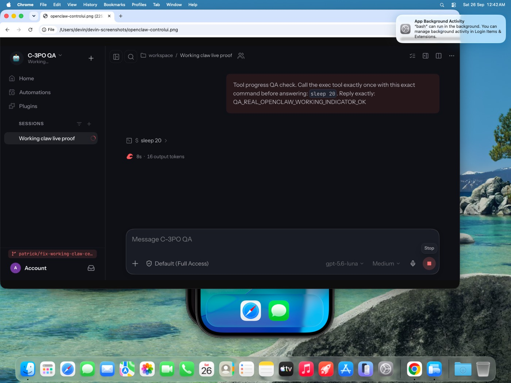
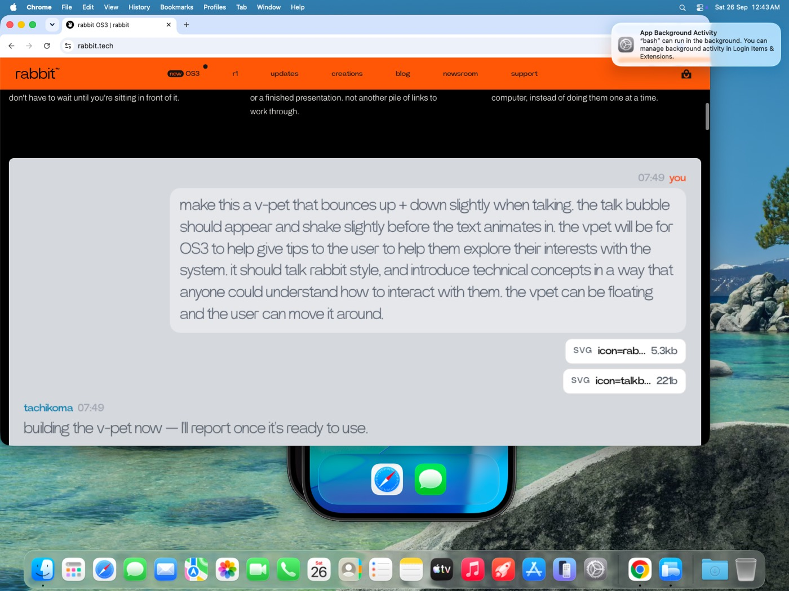
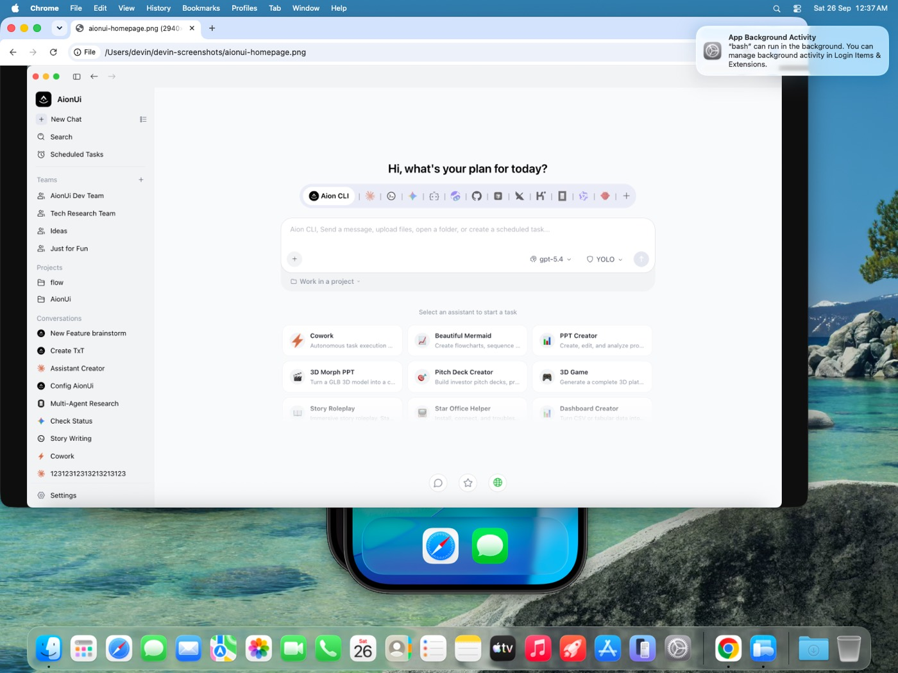
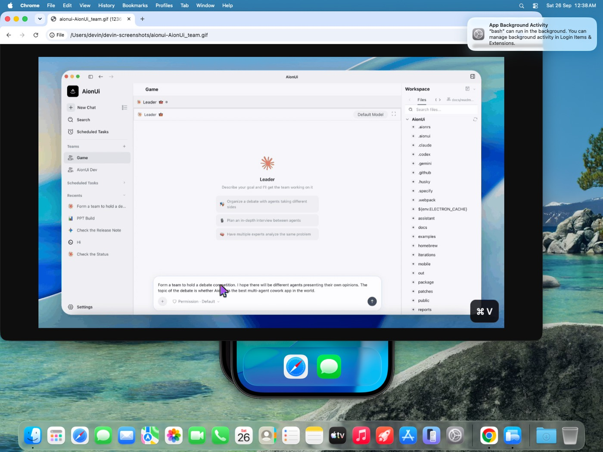

# Control-surface research: OpenClaw, rabbitOS 3, AionUi

Research for the "refined, smooth control surface" direction for the Hermes
desktop app. Sources were verified by browsing each product's site/docs and
(where possible) its repository — September 26, 2026.

## Name ambiguity note

"OpenClaw" names several unrelated projects (a Captain Claw game engine
reimplementation, among others). This report covers **openclaw/openclaw**, the
open-source personal-AI-assistant project whose Control UI is a Vite + Lit SPA
served by its Gateway on port 18789 — the AI-agent control/chat surface the
owner meant. The game-engine OpenClaw is not relevant and was excluded.

---

## 1. OpenClaw (openclaw/openclaw)

**What it is.** A personal AI assistant that lives on your own devices, reached
from WhatsApp/Telegram/Discord/etc., with a local **Gateway** daemon and a
**Control UI** web app (`ui/src/` in the repo — Lit, Vite, port 18789). The
Control UI is the operator surface: chat, dashboards, usage, approvals, devices,
cron, logs, sessions, skills, terminal, worktrees.

### What it does better than Hermes

- **Session rail with a live digest.** Selecting a session shows a compact pill
  (assessment line) that expands into a ~400px **session rail**: plan progress,
  PRs the run touched, elapsed time, and a read-only **companion thread**. The
  companion answers questions *about* the session ("what's left?", "why did it
  stop?") without interrupting or contaminating the running conversation
  (`ui/src/pages/chat/` + session-rail docs in `docs/web/control-ui.md`).
  Hermes rows show metadata but there is no per-session digest surface and no
  way to interrogate a run without entering it.
- **Composer escape hatches for tangents.** `/btw` and `/side` send a question
  to a parallel side-channel instead of the main turn — the "ask without
  interrupting" primitive the companion thread is built on.
- **Selection actions.** Selecting transcript text offers "More details" /
  "Ask in side chat" — a second consumption lane for output without derailing
  the run.
- **Agent switcher with scoped pages.** Choosing an agent scopes Chat, Usage,
  Automations, Tasks, Workboard, and Sessions to it. Hermes has profile
  isolation (islands), which is stronger, but no lightweight "look at one
  agent's world" lens over the shared pages.
- **Session hovercard.** Rows keep to a dot + title; hovering reveals creator,
  participants, project, branch, linked PRs, dashboard links, automations.
  Hermes' row already carries more inline metadata (opt-in rowMeta chips), but
  there is no "peek" affordance for the *full* context without resuming.
- **Workboard** (kanban plugin page) — a persistent task board across sessions.

## 2. rabbitOS 3 (rabbit.tech, launched 2026-09-22)

**What it is.** Rabbit's web/desktop agent OS (os3.rabbit.tech). Verified via
the launch materials (rabbit.tech newsroom, the os3 landing page, and launch
coverage, e.g. WIRED): you state an outcome in one continuous conversation and
OS3 decomposes it across a roster of up to 5 connected "rabbit" agents/devices
(one-command install per node), runs tasks in the background, and reports back
when finished or when a decision is needed. BYOK, paste-a-URL skills, DLAM
computer control, per-channel threads sharing memory.

### The owner's key question: how does it delegate without holding one chat context?

It doesn't fragment context — it **fans out outcomes, not conversations**. The
top-level chat is the only thread the user ever talks in; each connected node
gets a task card/job (shown as a delegation pill, e.g. a tachikoma-style worker
glyph per node) with its own sub-context, and results flow back into the same
stream as report cards ("done", "needs your decision"). There is deliberately
**no session list**: OS3 is a "brain dump" surface — a single stream plus a
task status layer. Delegation is implicit (the OS picks the device) rather than
user-routed.

### What it does better than Hermes

- **Zero ceremony to start work.** One box, one outcome statement; no session
  management at all. Hermes is the opposite extreme — explicit sessions, tabs,
  panes — which is a strength for power users but raises the cost of "just
  delegate a thing".
- **"Report when done / decision needed" contract.** Background tasks with a
  completion/decision report-back model, cleaner than polling a session. Hermes
  has the mechanics (background subagents, needs-input dots, approvals) but no
  first-class "report card" surface.
- **Node delegation as a roster.** Up-to-5 connected devices is a legible
  delegation model; Hermes' profiles/connections are more flexible but not
  presented as a delegation roster.

### What it does worse / not applicable

- Single-stream, no session history model — incompatible with Hermes' session
  semantics and with users running many long-lived projects. Take the
  delegation *metaphors* (outcome statements, report cards, node roster), not
  the one-thread paradigm.

## 3. AionUi (iOfficeAI/AionUi)

**What it is.** An open-source Electron "cowork" GUI that auto-detects 20+ CLI
agents (Claude Code, Codex, Gemini CLI, OpenClaw, and **Hermes** itself is in
its list) and gives them a unified control surface. Verified via the repo
README and captured UI.

### What it does better than Hermes

- **Team Mode.** A Leader agent coordinates Teammates through a shared Team MCP
  Server: shared workspace, a **task board**, an async **mailbox** between
  agents, and **per-agent permission dialogs** with sidebar approval badges.
  Hermes has `delegate_task` subagents and an Agents overlay (tree of runs),
  but no shared task board, no agent↔agent mailbox, and approvals are
  per-session rather than a team-wide queue.
- **Per-conversation skill indicator.** The chat header shows which skills are
  active for that conversation — a small "why is the agent behaving this way"
  legibility win. Hermes has no per-session capability indicator.
- **Preview Panel.** Multi-tab file/browser preview tracking the files an agent
  touches, editable in place. Hermes has a preview pane; AionUi's tracks the
  agent's active file set automatically.
- **Side-by-side multi-chat** (n panes of different agents at once). Hermes has
  panes/splits, so roughly parity.
- **21 assistant personas / assistants gallery**, custom CSS skins, WebUI +
  Telegram remote control. Hermes has bots and skins; parity-ish, different
  packaging.

## 4. Comparison table

| Capability | Hermes today | OpenClaw | rabbitOS 3 | AionUi |
|---|---|---|---|---|
| Session list w/ status | ✅ rich rows (dot states, rowMeta, PR, todo chip) | ✅ + live digest rail | ❌ none (one stream) | ✅ |
| Inspect a session w/o entering | ❌ | ✅ hovercard + rail digest | n/a | partial |
| Ask about a run w/o interrupting | ❌ | ✅ companion thread + `/btw` | ✅ (the only model) | ❌ |
| Cross-session task board | ❌ (kanban exists in Python/dashboard) | ✅ Workboard | ✅ report cards | ✅ team task board |
| Multi-agent coordination | subagents tree (Agents overlay) | agent switcher scoping | implicit device delegation | ✅ Team Mode (leader/teammates/mailbox/approvals) |
| Background work → report-back | needs-input/attention fold | session rail | ✅ core paradigm | approval badges |
| Per-session capability display | ❌ | partial (badges) | ❌ | ✅ skill indicator in header |
| Command palette | ✅ ⌘K | partial | ❌ | partial |
| Profile/isolation model | ✅ profiles-as-islands | per-agent | per-device | per-agent |
| i18n | ✅ 9 locales | partial | EN | 20+ locales |

## 5. Design proposal — mapping onto Hermes' architecture

Surfaces taxonomy per `DESIGN.md`: **page** (route) for destinations,
**overlay** for short tasks, **popover** for small contextual reveals — nothing
may auto-open (offer-don't-hijack), profiles stay islands, every user-facing
string is i18n'd, nothing may perturb prompt caching.

### Adopt (worth building, renderer-feasible)

1. **Session peek card** *(from OpenClaw's hovercard; also OS3's "status at a
   glance")* — hover/dwell on a rail row shows a popover with the session's
   full context: state, title, preview, workspace, branch + linked PR, model,
   counts/tokens/cost, timestamps, delegated-agent count, handoff origin. All
   data already in renderer stores (`SessionInfo`, `$pullRequestsByBranch`,
   `$sessionDotStateById`, `$subagentsBySession`, `$todoProgressBySession`).
   → **implemented in this PR** (slice below).
2. **A "delegated work" cluster in the peek / Agents overlay** — OS3's
   delegation pill, surfaced per-session (already partially done via the
   `delegating` dot state + Agents overlay; the peek card shows the count).

### Adapt (right idea, different shape — each is its own PR)

3. **Companion thread** *(OpenClaw's flagship idea)* — the real version needs a
   backend utility-model endpoint ("ask about session N") so questions never
   touch the live conversation's context — doing it renderer-side as a normal
   prompt would violate the prompt-cache invariant. Adaptation: a `session
   companion` RPC + a right-edge popover/page drawer on the session, reusing
   the transcript UI. Medium-large.
4. **Live digest line** *(OpenClaw session rail)* — a per-session "what it's
   doing now" summary needs a utility model or a cheapest-cacheable heuristic
   (current tool + todo progress already exist). Adaptation: start renderer-only
   — extend the row/dot-state data we have into the peek card and the composer
   status stack — before spending a model call.
5. **Report cards** *(OS3)* — when a background/delegated run settles, surface
   a completion card in the attention fold (we already have the fold + needs-
   input mechanics; the delta is copy + a summary line).
6. **Per-session capability indicator** *(AionUi)* — a chat-header chip showing
   active skill/toolset count for the session; needs a backend field, low risk.
7. **Workboard** *(OpenClaw/AionUi task boards)* — the Python `kanban` plugin
   already exists; expose it as a desktop page (route) rather than building a
   new board. Medium.

### Reject (wrong for Hermes, or conflict with invariants)

8. **OS3's single continuous stream / no session list** — incompatible with
   multi-project power use; sessions ARE the unit in Hermes. Take the
   delegation metaphors only.
9. **Implicit device/agent routing** (OS3 picks the worker) — conflicts with
   profiles-as-islands; Hermes keeps explicit routing.
10. **Selection popovers on transcript text** (OpenClaw "Ask in side chat") —
    high complexity/discoverability cost for marginal value; the composer
    already supports quoting.
11. **AionUi persona gallery / CSS skins** — Hermes' bot profiles + skin system
    cover it; gallery polish is a content problem, not a surface problem.
12. **Opening surfaces on events** (e.g. auto-open a digest when a run stalls)
    — violates offer-don't-hijack everywhere it was considered.

## 6. Implemented slice: Session peek card

The highest-impact, lowest-risk adopt item. Hover/dwell (or keyboard focus) on
any session row — flat or card — reveals a popover carrying the session's full
context, all sourced from data the renderer already holds (no fetches, no
backend). It is the control surface's "inspect without switching" gesture:
OpenClaw needed a rail page for this; we can afford a hovercard because our
rows already aggregate the stores.

- Surface kind: **popover** (not page/overlay — it is a contextual reveal on
  the row, per the taxonomy).
- Offer-don't-hijack: dwell-gated (~650 ms, longer than `OverflowTip`'s 600 ms
  so it only fires on intent; sibling tips yield while it is open), never opens
  uninvited, closes on click/drag/menu.
- Invariants kept: no fetch on open, no per-row listeners beyond existing
  `useStoreSelector` subscriptions, portal-rendered (zero cost to virtualized
  row height), all strings in `sidebar.peek.*` across the 9 locales.

Files: `src/app/chat/sidebar/session-peek.tsx` (new), wiring in
`session-row.tsx`, strings in `src/i18n/*.ts`.
