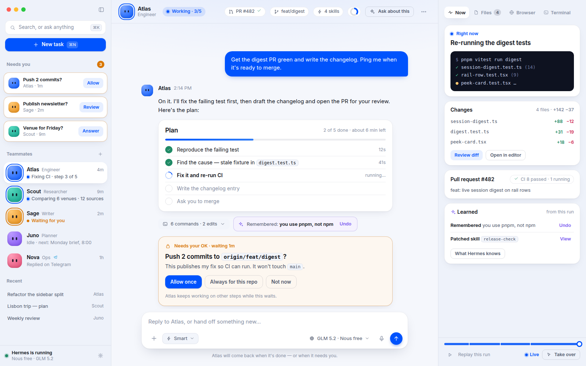
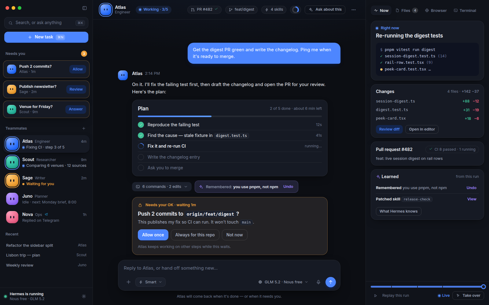
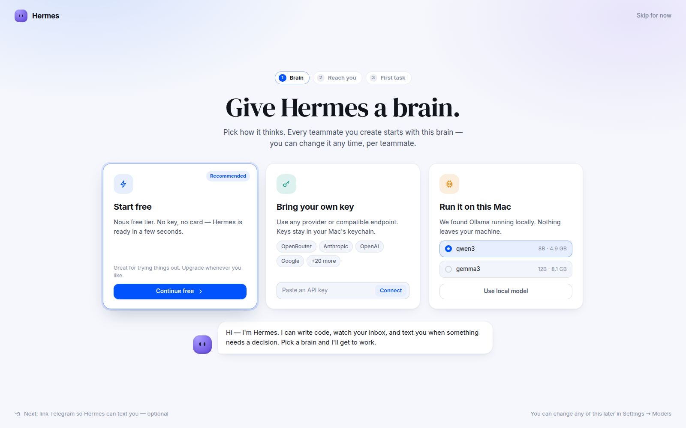
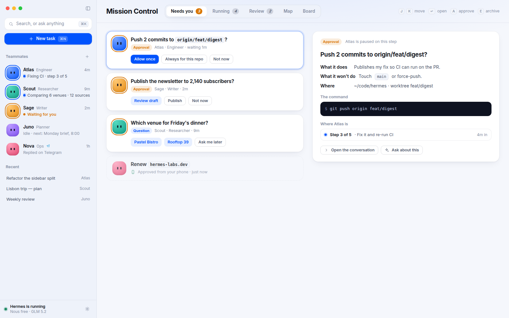
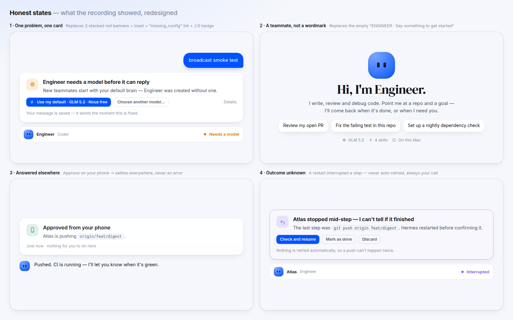

# Wave V — make the desktop look and work like the product we described

The brief for Devin (or any agent) to take the desktop from "a lot of features that look sad" to the
teammate-first agent OS described in [`revamp-plan.md`](./revamp-plan.md) §3 and
[`harness-research-2026.md`](./harness-research-2026.md). Companion to those docs; it **runs first**
(V0–V2, V4 don't depend on Wave 2's `store/fleet`) and replaces Wave 3's visual scope.

Every screen below has a rendered target in [`revamp/mockups/png/`](./revamp/mockups/png/) (source in
[`revamp/mockups/`](./revamp/mockups/)), and the "before" is in [`revamp/evidence/`](./revamp/evidence/).

| Target | |
|---|---|
| Team · conversation · Desk |  |
| Dark parity |  |
| First run |  |
| Mission Control |  |
| Honest states |  |

---

## 1. What the recording shows

Source: a 3-minute macOS screen recording of a Devin QA pass on the Bots surface (dev build `v0.21.5+3504`,
1600×1200). I sampled a frame every 6 seconds (30 frames) — no audio, and motion between samples is not
judged. Timestamps are `mm:ss` into the video; the "before" frames are in `revamp/evidence/`. Sizes below are
measured on those frames (1200px-wide samples of the capture), so treat pixel figures as **relative**, not CSS px.

**What works and stays:** the blob avatars have charm; the Work / Unassigned sections and drag-to-section;
the filter menu logic; the New-group-chat dialog; "Create with QR" for Telegram; "New chat with this bot".

### Findings

| # | Seen | Sev | Evidence |
|---|---|---|---|
| F1 | **One failure, announced five ways.** A bot with no model produces: three stacked red banners (four buttons each), a toast quoting CLI steps (`Run hermes model … put OPENROUTER_API_KEY in ~/.hermes/profiles/test-bot/.env`), a **NEEDS ATTENTION** box printing the raw enum `missing_config`, `⚠2` / `⚠5` badges on rail rows, and `⚠` entries in the right panel's Task log. Nothing says what to *do* in the UI. | P0 | 0:18, 0:54, 2:42, 2:54 · `before-01`, `before-05` |
| F2 | **Assign task is broken for every local bot:** toast `Couldn't send the task: name '_local_roster' is not defined`. Root cause in §3 P0-1. | P0 | 1:54–2:18 · `before-03` |
| F3 | **A bot with no model is presented as a normal, ready bot.** The profile `test-bot` has no provider, yet the UI lets you message it, broadcast to it, and duplicate it (`Engineer (copy) (copy)`) with no hint. Profiles are islands by design, so a new bot must be *offered* a copy of the default brain, not silently left empty. (Whether it was created in the UI or via the CLI isn't visible — check the create flow.) | P0 | 0:18–2:54 |
| F4 | **Dead ends in prime positions.** The centre canvas says *"No bot screen on this host — Bot screens run on Linux gateway hosts"*; the right panel stacks *Computer: Not available on this host*, *No scheduled jobs yet*, *No deliverables yet*, *No artifacts in this session*. Four or five empty/negative panels on one screen, on a Mac. | P1 | 0:00, 0:42 · `before-02` |
| F5 | **No hierarchy.** Almost all text is tiny, grey, and ALL-CAPS: tab titles, section labels, three *rotated* pane labels (`SCHEDULED JOBS`, `ARTIFACTS`, `TERMINAL`). Avatars are ~20px at frame scale. The left rail is ≈14% of the window, the two right panes ≈27%, and the centre ≈58% with content pinned to the top-left of a mostly empty canvas. | P1 | every frame |
| F6 | **A 19-item context menu on a bot row** (Open Bot Chat, Stop run, Assign task…, Open Screen, Continue on phone…, Open Screen when the bot uses it, Pin to top, Hide, Watch, Notifications ▸, Edit…, Groups…, Model ▸, Duplicate, Export bot…, New chat with this bot, Open recent session, Move to section ▸, Delete). Features exposed as menu rows instead of moments. | P1 | 2:18 · `before-04` |
| F7 | **The composer is a row of riddles:** `Refine the request`, `Glm 5.2`, `Med`, an unlabeled circle, `Smart`, a mic, and a black waveform button. | P1 | every frame |
| F8 | **Error banner persists in an empty `UNTITLED SESSION`** (no message sent) for at least 80 seconds across other actions. *Unverified:* may be leaked state or a real earlier failure — Devin must check per-session scoping. | P1 | 0:54–2:18 |
| F9 | **The one moment with character is a wordmark:** a huge blue serif `ENGINEER` with a 40px blob above it. It proves the brand can speak, but it's a title, not a teammate. | — | 0:42 · `before-02` |
| F10 | Messaging settings: 25 platforms as a flat list with tiny status dots; "Applies to" chips overflow (`default · Engineer · Engineer (copy) · Engineer (copy) (co…`). The good thing (QR quick setup) sits under the fold. | P2 | 2:42–2:54 · `before-05` |

**Important caveat.** The tester's profile had no provider, so every bot fails. That's partly the
environment — and exactly why it matters: the app let a user reach a dead end and then said so five times.
A healthy setup would look calmer, but F2, F4–F7, F9 stand regardless.

### Verified in code (not just seen)

- `tui_gateway/methods_bot_mailbox.py:63` — `bots_mailbox.send` calls `_local_roster(root)` as its first real
  statement. `method_ctx.rebind()` re-creates every handler against **server.py's globals**, so bare
  module-level helpers don't resolve. `_root=_mailbox_root` works only because it's a *default argument*
  (survives `FunctionType`). `register()` (line 190) only calls `_registry.install(server)` — it never
  publishes `_local_roster` / `_notify_sender_status`, and `grep _local_roster tui_gateway/server.py` is empty.
  The generic `except Exception → _err(rid, 5102, str(e))` turns the `NameError` into the toast verbatim.
  **No test in `tests/` references `bots_mailbox`** — #48 shipped without a real-path check.
- `bots_mailbox.update` (lines 160–162) has the *same* bug inside `try: … except Exception: logger.debug(...)`:
  the sender bot never receives its status line, and nothing surfaces it.
- `plugins/hermes-bots/i18n.ts:703` — the localized hint for a missing provider is
  *"Provider not configured — run hermes model"*: a terminal instruction shown to desktop users, in every locale.
- `components/ui/pane-tab.tsx` and `plugins/kanban/board.tsx` are the `writing-mode` (rotated label) sites.
- *Not located:* the component that prints the raw `Engineer: missing_config` line. Start from
  `grep -rn "attention" src/plugins/hermes-bots src/app/chat/sidebar`; `botAttentionHint` (`data.ts:68`) is
  used for tooltips only.

---

## 2. Why it feels sad

1. **Every state is an error or a void.** Healthy states are missing; failure states are loud and repeated.
2. **No hierarchy.** One size, one weight, one grey — so nothing is *the* thing. A new user can't tell who is
   working, what they're doing, or what needs them.
3. **The product's promise isn't visible.** We sell *teammates*; the UI shows 20px icons and jargon
   (`UNASSIGNED`, `Canonical`, `Task log`, `Deliverables`).
4. **Chrome is louder than content** — rotated labels, uppercase micro-type, two right columns; content gets
   <50% of the canvas.
5. **Features are menu rows, not moments.** 19 items on one right-click; the best ideas (broadcast, routines
   calendar, continue on phone) are buried.
6. **Process:** features merged with green unit tests but never *driven in the real app with a working
   model* (F2 is proof). Fixing the pixels without fixing this repeats the problem — see §8 QA protocol.

---

## 3. V0 — P0 fixes (do these before any visual work)

**P0-1 · `bots_mailbox` NameError (backend, ~10 lines + a real test).**
Follow the file's own pattern: give the handlers the helpers as default args
(`def _(rid, params, _root=_mailbox_root, _roster=_local_roster)`; same for `_notify_sender_status` in
`update`), *or* whichever sibling-module convention `method_ctx` documents — check how the other
`methods_*` files solve it and match them. Then:
- Change the `logger.debug` in `update` to `logger.warning` so this failure class is visible.
- **Test through the real dispatch**, temp `HERMES_HOME`, one real local profile: `bots_mailbox.send` returns
  `{note, …}` not error 5102; `update` on a bot-sent note reaches `_notify_sender_status`.
- Consider one contract test that walks every rebound handler's `LOAD_GLOBAL` names (via `dis`) and asserts
  each resolves in `vars(server)` or builtins — this catches the whole *bug class* for all split modules.
  (It reads bytecode names, not source text; judge against the "never read source in tests" rule.)

**P0-2 · Never present a brainless bot as ready.** Decision needed in V2 (see §5.2): creating a bot offers
"Start from my current setup" (clone model + provider — the sanctioned path, profiles stay islands) and defaults
to it; if *no* profile has a brain, the first-run wizard runs. A bot without a model shows the
"needs a model" card (states sheet #1), and the composer says so instead of letting a send fail.
Verify first whether create-bot already passes `clone`; don't add a second mechanism.

**P0-3 · Error system: one problem → one card.** Replace stacked banners + toast + list + badges:

| Class | Title (sentence case, human) | Primary action | Never shown |
|---|---|---|---|
| `no_model` | *‹Bot› needs a model before it can reply* | **Use my default · ‹model›** | CLI commands, env-var paths |
| `auth_invalid` | *‹Provider› rejected the key* | **Update key** | raw HTTP status in the title |
| `quota` | *‹Provider› is out of quota* | **Switch model** / **Add credit** | |
| `network` | *Can't reach ‹provider›* | **Retry** (auto-backoff) | |
| `tool_failed` | *‹Tool› failed* | **Retry** / **Ask ‹bot› to fix it** | stack traces |
| `backend_down` | *Hermes is reconnecting…* | (soft row state; no card) | full-screen overlay |
| `unknown_run` | *‹Bot› stopped mid-step — I can't tell if it finished* | **Check and resume** / **Mark as done** / **Discard** | any auto-retry |
| `denied` | *Hermes needs permission to …* | **Allow once / this session / always** | |

Rules: **dedupe** per (session, class) — a repeat updates the existing card's count, never adds one;
**scope** to the session that failed (fix F8); toasts are for transient/non-blocking things only; rail
rows show one quiet coloured dot with a tooltip, never numeric `⚠` piles; details (raw error, logs,
diagnostics) live behind one "Details" disclosure; the message is durable at send — say so ("Your message
is saved — it sends the moment this is fixed"; matches the `prompt.submit` guarantee in `AGENTS.md`).
Copy comes from i18n in all 9 locales; `ar`/`ja`/`zh-hant` degrade honestly.

**P0-4 · Demo fixture.** `npm run dev:mock` already exists (`tests-js/scripts/mock-server.ts`,
`mock-provider-config.ts`). Extend it into a **populated** fixture matching the mockups — five teammates
(Atlas working, Scout working, Sage needs-you, Juno idle, Nova on Telegram), a mid-run plan, three
needs-you items, a diff, a PR + CI, learned items, and one of each honest state. Every Wave V PR takes its
screenshots from this, so reviews compare like with like (an empty app makes every design look sad).

---

## 4. Design language v2

Tokens: [`revamp/mockups/tokens.css`](./revamp/mockups/tokens.css) (light + dark). Existing names are
reused; new ones are `--v2-*`. **This amends `DESIGN.md` — see gate G7.**

### 4.1 What changes vs `DESIGN.md`

| Today | v2 | Why |
|---|---|---|
| Principle 1: *"Flat, not boxed"* | **Flat chrome, one-level work objects.** Plan, needs-you, receipt, approval, run and composer are raised cards (`--v2-shadow-card`); rails/headers/panes stay flat; **never nested** (the "no card-in-card" rule stays). | Work objects must read as *things*; flatness is what made everything equal. |
| Micro ALL-CAPS grey labels | **Sentence-case, 12px minimum**; body 15px; one optional "overline" style. | Legibility; hierarchy. |
| Rotated vertical pane labels | **Retired** → a segmented tab row in the Desk header. | Unreadable, wasteful. |
| Grey blob icons at 20px | **Persona avatars ≥ 40px** on primary lists, with a state ring. | Teammates are the product. |
| Ad-hoc badge counts | **One state ramp** (working / needs-you / done / failed / unknown / idle) used by dots, rings, pills, cards, tray, HUD. | One glance, one meaning. |
| Dense only | **Comfortable (default) + Compact** (today's density kept for power users). | Don't punish existing users. |

Unchanged and non-negotiable: tokens not literals; one primitive per concern (`Button`, `SearchField`,
`CardStack`, `OverlayView`, `Tip`, `ListRow`, `ConfirmDialog`); Tips only where hover teaches; no native
`title=`; i18n ×9; offer-don't-hijack; hot interactions stay cheap.

### 4.2 Components to build (each with all states, light + dark, in a dev-only design sheet)

| Component | States | Reads from (existing seam) |
|---|---|---|
| `PersonaAvatar` (+ ring) | working · needs-you · idle · done · failed; 30/40/84px | bot/profile identity, `session-digest`, `agent-notices` |
| `TeammateRow` | + one-line live status; Telegram/Slack badge | `plugins/hermes-bots`, `store/session-digest.ts`, `fleet-runs` |
| `NeedsYouCard` (rail + Mission Control) | approval · question · secret · interrupted · answered-elsewhere | `store/attention-inbox.ts`, `agent-notices.ts` |
| `PlanCard` | pending · active · done · failed; progress; ETA | todos store / plan artifacts |
| `ApprovalCard` | **Allow once / This session / Always for this pattern** / Not now; non-blocking note | existing approval `CardStack` — restyle, don't fork |
| `LearnedReceipt` | remembered · skill created · skill patched · **Undo** (archive, never delete) | tool calls already in the transcript (`memory`, `skill_manage`) |
| `RunReceipt` | plan · diff stat · commands · screenshots · PR · CI | report cards (`delegation-reports`), review pane |
| `ErrorCard` | the §3 P0-3 taxonomy | one resolver; replaces banner + toast paths |
| `EmptyHero` | teammate intro · no-brain · nothing scheduled | persona + role; ≤1 CTA |
| `Desk` (Now · Files · Browser · Terminal + replay scrubber) | live · replay · idle · unavailable-hidden | preview/terminal panes, tool-call events |
| `HeaderStrip` | state · PR/CI · branch · skills · context ring · Ask | `pr-tag.tsx`, `skill-tag.tsx`, context ring |
| `Composer v2` | outcome-first placeholder; labelled mode/model popovers | `app/chat/composer/index.tsx` |

Copy rules: first person and warm ("Hi, I'm Engineer."), no jargon (`Canonical`, `Task log`, `Deliverables`
→ **Now / Next / Done**), no CLI instructions in primary text, no raw enums, ever.

---

## 5. Signature screens (targets in `revamp/mockups/png/`)

### 5.1 Team · Conversation · Desk — `team-desk.png`
- **Rail:** search/⌘K, one filled **New task** button; *Needs you* (only when non-empty) as compact cards
  with the one action; *Teammates* (avatar ring + name + role + **a sentence of what they're doing**);
  *Recent*; footer says whether Hermes is running and on which model.
- **Conversation:** header strip (state, PR/CI, branch, skills, context ring, Ask); the user's message is a
  plain blue bubble (messaging-a-person feel); the teammate speaks without a bubble; **plan card** live-updates;
  **learned receipt** appears when memory/skills change; **approval card** with three permission tiers and
  *"Atlas keeps working on other steps while this waits."*; composer is outcome-first and every control is
  labelled; the line under it states the return contract.
- **Desk:** *Now* (a sentence + live terminal/browser), *Changes* (diff stat → Review), *Pull request + CI*,
  *Learned from this run*, and a **replay scrubber** with *Live* and *Take over*.

### 5.2 First run — `first-run.png`
Three honest choices: **Start free** (recommended), **Bring your own key**, **Run it on this Mac** (detected local
models). The line under the headline states the rule: *every teammate you create starts with this brain*.
Hermes "speaks" in a bubble. Step 2 (*reach you* — Telegram/QR) and 3 (*first task* — a starter) follow.
Free-tier copy and eligibility come from `free_tier.status`, never hard-coded; obey the ruled copy in
`src/AGENTS.md`.

### 5.3 Mission Control — `mission-control.png`
One queue of everything that needs you (approval / question / interrupted), ordered by age, with the action
inline, a detail pane, and keyboard triage (`J K ↵ A E`). *Answered elsewhere* rows fade and stay visible.
Lenses: Needs you · Running · Review · Map · Board. (Route consolidation is gate G1 in `revamp-plan.md`.)

### 5.4 Honest states — `states.png`
1 *One problem, one card* · 2 *A teammate, not a wordmark* · 3 *Answered elsewhere* · 4 *Outcome unknown*.
States 3–4 are the upstream one-gateway cases (`revamp-plan.md` §2.3); build them capability-gated so they're
inert on today's pooled backend.

---

## 6. "Best of" — translated into this app

Patterns come from each product's documented behaviour (see `agentic-desktop-roadmap.md` §1 and
`harness-research-2026.md`) — **not pixel copies**; where a reference matters, Devin should look at the current
product and note deviations in the PR.

| From | The pattern | Here | Data |
|---|---|---|---|
| **Manus** | A live "computer" you can watch and **replay**; a step plan that ticks off; per-command *Allow once / Always*; a deliverables list; take over | **Desk › Now** + Terminal/Browser tabs + **replay scrubber** + **Take over**; **PlanCard**; **ApprovalCard** tiers; **Files** tab | tool-call events already in the transcript (replay = re-render stored events — verify feasibility; no new RPC) |
| **Muse** | Feels like messaging a person; warm, first-person; goal → plan; proactive but consented | plain chat bubbles, no chrome; persona greeting; **outcome-first composer**; nudges as *offers*; Telegram parity badge | persona identity, plan, nudge store |
| **Grok Bot** | Bots are teammates with a desk; they come back **only when done or needing you**; hand control back; secure asks; chaining | Team rail + persona rows; the return-contract line; **Take over**; masked-input card; "Atlas asked Scout" mailbox card | mailbox (after P0-1), approvals, secret asks |
| **Hermes-only** | It **learns** | **Learned receipts** inline + Desk card + *What Hermes knows* page; the curator timeline | memory / `skill_manage` calls, curator state, insights |

---

## 7. Feature-quality sweep (V6) — what "good" means per surface

| Surface (as recorded) | Target | Acceptance (testable in the demo fixture) |
|---|---|---|
| Bot row context menu (19) | **6 primary** — Message · Assign a task · Open desk · Pin · Edit · **More ▸** (the rest, grouped) | ≤ 7 top-level rows; `Delete` only under More with confirm |
| Bot right panel: Task log · Sessions `Canonical` · Computer · Scheduled jobs · Deliverables | **Now / Next / Done** (Now = current step; Next = queued + scheduled; Done = receipts + files) | 0 empty-state panels on a healthy bot; unavailable capabilities **hidden**, never "Not available on this host" |
| "No bot screen on this host" as the centre canvas | never a canvas; a disabled entry under More with a tooltip | centre canvas is always a conversation or launchpad |
| Composer | labelled **Mode** popover (Smart = what?), model pill shows provider + local/free badge, reasoning inside the popover, mic labelled | every icon button has `aria-label` + Tip where discovery needs it; 0 unexplained pills |
| NEEDS ATTENTION strip | the error-card sentence + its one fix; **no raw enums, no CLI text** | grep-able: `missing_config` and `run hermes model` absent from user-visible i18n |
| Duplicate bot | ask for a name; default `Engineer 2` | no `(copy) (copy)` |
| Rail filter menu | keep; rename *Attention first → Needs you first* | copy only |
| Group chat dialog | keep; show role chips per member; optional purpose line | — |
| Messaging settings | promote **Create with QR**; top 6 platforms as cards + "More"; single profile picker instead of overflowing "Applies to" chips | one primary action above the fold |
| Bots roster header actions (`Broadcast to bots…`, `Routines calendar…`) | rail header: **Ask everyone**, **Schedule** | reachable in 1 click, labelled |
| Assign task (after P0-1) | a real flow: teammate picker, outcome, check-in cadence; result lands as a **mailbox card** in both chats | e2e: send → target's Bot Chat receives it → `update` notifies the sender |

---

## 8. Execution plan and QA protocol

### 8.1 Order (parallelism ≤ 3 children, `swe-2-high`; ≤ 5 sessions total)

| Wave | PRs (one per line) | Depends on |
|---|---|---|
| **V0** | (a) P0-1 mailbox fix + real-dispatch test · (b) P0-4 populated demo fixture · (c) P0-3 error taxonomy + `ErrorCard`, dedupe, session scope | — |
| **V1** | Design language v2 behind a display toggle (`ui.v2` in `config.yaml`, **not** an env var): tokens, `PersonaAvatar`, work-object `Card`, chips/pills, type scale, **dev-only design sheet route** rendering every component in every state, light + dark, with Playwright visual snapshots | V0(b), gate G7 |
| **V2** | First-run brain screen; create-bot "start from my setup"; no-brain states (P0-2) | V1 |
| **V3** | Team rail (rows, needs-you cards, live status lines); header strip; Composer v2. Read existing stores through two thin hooks (`useTeammates`, `useNeedsYou`) so Wave 2's `store/fleet` swaps the internals later | V1 |
| **V4** | Honest states: `EmptyHero`, answered-elsewhere, unknown-run — capability-gated | V0(c), V1 |
| **V5** | Desk (Now/Files/Browser/Terminal + replay), `PlanCard`, `RunReceipt`, `LearnedReceipt` | V1, V3 |
| **V6** | §7 sweep, one PR per row group | V3 |
| **V7** | Motion, dark-mode parity, a11y (focus order, `Esc`, reduced-motion), 9-locale audit, perf re-measure (Wave 0.2 harness), snapshot refresh | all |

Cutover-safety (`revamp-plan.md` §2.4) applies to every PR: no new RPC on `tui_gateway/server.py`, no changes to
`store/gateway.ts` / boot / pool code. P0-1 is a fork-only backend fix that the upstream sync will re-home.

### 8.2 Visual QA — every PR must include

1. **Screenshots from the demo fixture** at 1600×1000 and 1280×800, **light and dark**, for: healthy, empty,
   and the relevant error state.
2. A **20–30 s recording** of the golden path *with a working model* (not a mock that skips the failure).
3. A **side-by-side against the mockup PNG** with a short "deviations and why".
4. Typecheck, lint, affected vitest; e2e visual snapshots updated **only** for intended changes.
5. The two scores below.

**Sad-meter** (count on the first screen; thresholds are pass/fail):
healthy-state error banners **0** · empty/negative panels **≤ 1** · ALL-CAPS labels **≤ 1** · unlabeled icon buttons
**0** · avatar size on primary lists **≥ 40px** · filled (primary) buttons **exactly 1 per region** · body text
**≥ 14px**, meta **≥ 12px**.

**5-second test** (someone unfamiliar, first screen only): can they say *who is working*, *what they're doing*,
*what needs me*, and *how do I start*? Any "no" is a fail. Record who ran it.

### 8.3 Process rule that would have caught F2
A feature isn't done until its golden path has run **in the real app with a working model** (or a real-path
test through the actual dispatch), and the PR shows it. Green unit tests over mocks don't count — this is the
repo's own "E2E validation, not just green unit mocks" rule (root `AGENTS.md`), applied.

---

## 9. Owner decision gates

- **G7 — Amend `DESIGN.md`.** Approve §4.1 (flat chrome + one-level work objects; sentence-case 12px+ type;
  retire rotated labels; persona avatars; comfortable default). *Recommend yes* — it's what "not sad" requires.
- **G8 — Naming.** "Bots" → **Teammates** in user-facing copy (the `hermes-bots` plugin and Bot Mode identity
  rules are unchanged). *Recommend yes.*
- **G9 — v2 rollout.** Ship v2 as the default with a "classic" toggle for one release, or opt-in first?
  *Recommend default-on with classic toggle* — opt-in features are how the last 50 PRs went unseen.
- **G10 — Free-tier as the recommended first choice** in the brain screen (copy per `free_tier.status`).
  *Recommend yes.*
- Carried over from `revamp-plan.md`: G1 Mission Control merge, G3 default flips, G4 feature freeze, G5/G6.

---

## 10. What I could not verify

- Only 30 sampled frames, no audio; the recording is one QA pass on one profile.
- Grok Bot / Muse / Manus visuals are inferred from documented behaviour; I have not seen their current UIs.
- The mockups use stand-in fonts (Inter, a serif for Collapse) and hand-drawn icons — they fix hierarchy,
  spacing and behaviour, not final typography or iconography.
- I did not locate the component printing the raw `missing_config`, and I have not run the backend tests
  (no venv here) — P0-1 is diagnosed from code, not reproduced.
- F8 (error banner persisting in an empty session) is unverified.

---

## 11. Brief for the orchestrating Devin session (copy-paste)

> Implement `apps/desktop/docs/revamp-visual-plan.md` (Wave V). First read root `AGENTS.md`,
> `apps/desktop/AGENTS.md`, `apps/desktop/src/AGENTS.md`, `DESIGN.md`, then `revamp-plan.md` §2 (upstream gateway)
> and this doc §1–§4. Open the target PNGs in `docs/revamp/mockups/png/` and the "before" frames in
> `docs/revamp/evidence/` — every PR is judged against those.
> **Start with V0, three parallel lanes:** (a) fix `tui_gateway/methods_bot_mailbox.py` (`_local_roster` /
> `_notify_sender_status` are unresolved names inside handlers that `method_ctx.rebind` re-creates against
> server.py's globals; pass them as default args like `_root`), with a test through the real dispatch —
> do not merge without it; (b) extend `npm run dev:mock` into the populated demo fixture; (c) build the
> error taxonomy + `ErrorCard` with dedupe and per-session scope. **Then** wait for owner gate G7 before V1.
> Rules: cutover-safe (no new RPC on `tui_gateway/server.py`; don't touch `store/gateway.ts`/boot/pool);
> renderer-first; i18n ×9; offer-don't-hijack; one primitive per concern; small PRs off latest `main`;
> `npm run typecheck && npm run lint && npx vitest run <affected>` from `apps/desktop` before each PR.
> Every PR carries §8.2's screenshots (light + dark, demo fixture), a golden-path recording **with a working
> model**, a side-by-side against the mockup, and the sad-meter + 5-second scores. Max 3 children
> (`swe-2-high`). Escalate any UX fork instead of guessing. Report after each wave: PR links, sad-meter
> before/after, and anything in this plan the code proved wrong.
