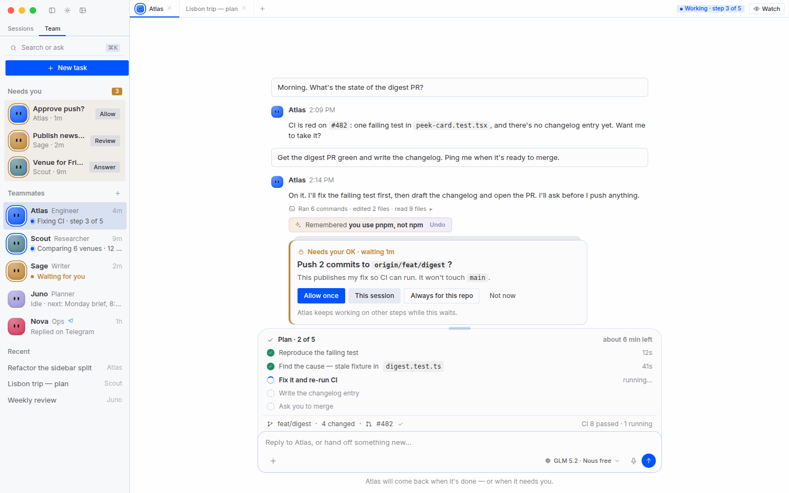
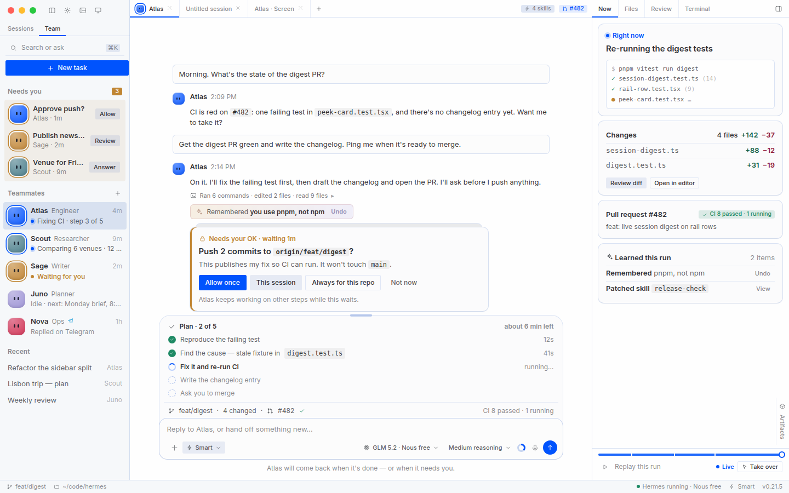
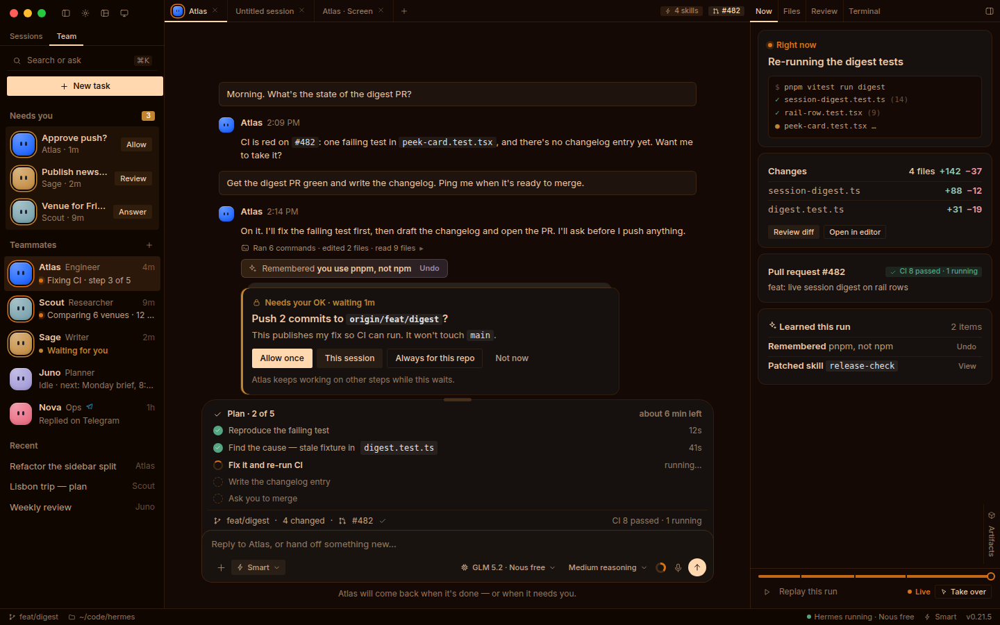

# Wave V — the visual and quality pass, built on the desktop that exists

The brief for Devin (or any agent) to take the desktop from "a lot of features that look sad" to a product
that is calm for everyday users and complete for developers. Companion to [`revamp-plan.md`](./revamp-plan.md)
(architecture + upstream gateway), [`harness-research-2026.md`](./harness-research-2026.md) (market), and
[`bot-mode-plan.md`](./bot-mode-plan.md) (the flagship surface, **Wave B**).

> **What changed from the previous version of this doc.** The first draft drew a *parallel* design language
> (soft-rounded cards, a new `--v2-*` palette, 15px body text) and a shell that didn't exist. After reading
> the code, this version is a **delta on the shipped app**: it rides the real token/skin pipeline, the real
> primitives, the real **Simple / Advanced** interface modes, and the real pane-shell. Every mockup was
> re-rendered from the app's own `styles.css` tokens and theme seeds (`revamp/mockups/real-tokens.css`).

| Simple mode | Advanced mode (developers) |
|---|---|
|  |  |
| Sidebar + chat; the run's state is one badge and a **Watch** button (offer, don't hijack) | Same session, plus the right zone (**Now** · Work · Profile · Files · Review · Terminal), statusbar, chips |

---

## 1. What the recording shows

Source: a 3-minute macOS recording of a Devin QA pass on the Bots surface (dev build `v0.21.5+3504`). I sampled
one frame every 6 seconds (30 frames), no audio; motion between samples isn't judged. Timestamps are `mm:ss`;
the "before" frames are in [`revamp/evidence/`](./revamp/evidence/). Pixel figures are relative (frame scale).

**Keep:** blob avatars; Work/Unassigned sections; the filter menu logic; the New-group-chat dialog; Telegram
"Create with QR"; "New chat with this bot"; the chat empty state's 96px face + wordmark.

| # | Seen | Sev | Root cause (verified) |
|---|---|---|---|
| F1 | **One failure, announced five ways** — three stacked red banners, a toast quoting CLI steps, a **NEEDS ATTENTION** box printing raw `missing_config`, `⚠2`/`⚠5` badges, `⚠` rows in the side panel (0:18, 0:54, 2:42, 2:54; `before-01`, `before-05`) | P0 | The backend *already* raises `AuthError(..., code="no_provider_configured")` (`hermes_cli/auth.py:1634`; asserted in `tests/hermes_cli/test_cli_first_run_setup.py:370`), but the desktop's `ERROR_CODE_KEYS` (`src/lib/error-surface.ts:27-63`) has **no entry** for it. It falls to the generic layer and the raw CLI message. Nothing dedupes. |
| F2 | **Assign task fails for every local bot:** `name '_local_roster' is not defined` (1:54–2:18; `before-03`) | P0 | `tui_gateway/methods_bot_mailbox.py:63` — `method_ctx.rebind()` re-creates handlers against **server.py's globals**, so bare module helpers don't resolve; `register()` (line 190) only calls `_registry.install`. `update` (160–162) has the same bug swallowed by `logger.debug`. **No test references `bots_mailbox`.** |
| F3 | **Bots with no model look ready.** `test-bot` can be messaged, broadcast to, duplicated (`Engineer (copy) (copy)`) | P0 | Docs: a new bot *copies static API keys only*; OAuth logins aren't copied and the remedy is a CLI command (`hermes -p <name> auth add …`); the free-tier identity is per-home. Whether the tester's default used OAuth/free tier isn't visible — **likely**. |
| F4 | **Dead ends in prime positions:** centre says *"No bot screen on this host"*; right panel stacks *Computer: Not available on this host*, *No scheduled jobs yet*, *No deliverables yet*, *No artifacts…* (0:00, 0:42; `before-02`) | P1 | Screens need a Linux gateway host (`tools/bot_desktop/`); the UI shows the absence instead of hiding it. |
| F5 | **Faint, tiny type.** All-caps 10–11px grey labels; rotated pane labels; ~20px avatars | P1 | *Computed from the real tokens (nous light):* `--ui-text-tertiary` on chrome = **3.5:1** (AA needs 4.5:1); `--ui-text-quaternary` = **2.2:1**. The rotated labels are the **vertical restore rails** for minimized zones (`pane-tab.tsx` `TAB_VERTICAL`) — intentional, but illegible. |
| F6 | **19-item context menu** on a bot row (2:18; `before-04`) | P1 | Features exposed as rows, not moments. |
| F7 | **Composer riddles:** `Refine the request`, `Glm 5.2`, `Med`, an unlabeled circle, `Smart`, mic, black waveform | P1 | `Smart` is the **approval mode** (`approvals.mode`: manual/smart/off, profile-scoped) — unlabeled. |
| F8 | **Error banner persists in an empty `UNTITLED SESSION`** for ≥ 80 s (0:54–2:18) | P1 | *Unverified* — leaked state or a real earlier failure; check per-session scoping. |
| F9 | Bot empty state is a wordmark + small face | — | `plugins/hermes-bots/chat-empty.tsx` already renders a **96px face + Wordmark** — the target *extends* it (role line, starters, facts), it doesn't replace it. |
| F10 | Messaging settings: 25 platforms flat; overflowing "Applies to" chips; QR quick-setup below the fold | P2 | — |
| **F11** | **The recording was in Advanced mode** (statusbar, terminal rail, right panes). New users get this by default | P1 | `DEFAULT_INTERFACE_MODE = 'advanced'`, encoded as *no key* (`store/interface-mode.ts`). Only first-launch onboarding (`LAYOUTS` in `onboarding-chat/options.tsx`) offers Simple. |

Part of F1/F3 is the test profile having no provider. That's exactly why they matter: the app let a user reach
a dead end and then said so five times. A healthy setup is calmer, but F2, F4–F7, F11 stand regardless.

---

## 2. Ground truth — how the desktop is built (what v2 must ride)

**Interface modes** (`src/store/interface-mode.ts`). `'simple' | 'advanced'`, persisted at
`hermes.desktop.interfaceMode.v1`. **A mode is a resolver input, not a preset:**
`effective(surface) = sessionReveal ?? policy[mode] ?? userPreference`. Simple *shadows* preferences — it never
overwrites them; a toggle pressed while shadowed lands in an in-memory session layer ("reveal"), so a mode is a
default, not a lock. Mechanisms: `modeBound()` wraps a preference; `ModePolicy` keys today are `artifactsOpen`,
`fileBrowserOpen`, `hideCodeDiffs`, `profileRailVisible`, `reasoningCollapsedByDefault`, `reviewOpen`,
`sidebarRowMeta`, `statusbarVisible`, `terminalOpen`, `toolViewMode`; lists tag items with `tier` and filter with
`shownInMode`; `$showsAdvancedChrome` for single elements. **Layouts persist per mode** (`modeLayout`), presets
are tagged (`sidebar-left`/`sidebar-right` = simple; `default`, `basic`, `focus`, `terminal-deck`, `quad` =
advanced — `app/contrib/layout-presets.ts`). Copy: *Simple — "for talking to Hermes"*; *Advanced — "for developers"*.

**Shell** (`components/pane-shell`). A layout tree of zones holding panes: `sessions`, `workspace` (chat/session
tiles), `review`, `files`, `terminal`, dynamic preview tiles, plus contributed panes. Tab strips live *inside*
their zone (`pane-tab.tsx`: 11px, weight 500, 2px `--theme-primary` underline when active; minimized groups become
vertical restore rails). Panels extend into the native titlebar band; the sidebar's tabs sit on a row *below* the
window controls. Simple's titlebar shows only sidebar / settings / layout editor (`TITLEBAR_FIXED_TOOLS`).

**Tokens, skins, glass.** `styles.css` derives everything from **seeds** (`--theme-foreground`, `-primary`,
`-background-seed`, `-sidebar-seed`, `-card-seed`, …) via `color-mix`; `themes/context.tsx applyTheme()` sets the
seeds from a skin; **11 built-in skins** (`nous` default, github, catppuccin, everforest, solarized, nous-alt,
midnight, ember, mono, slate, cyberpunk) plus user themes, VS Code import, backend skins, per-profile themes.
A skin controls **colours + font families only**; radius, sizing, type scale, line-height live in `styles.css`.
`--radius-scalar: 0.2` makes controls near-square. The sidebar is **glass** by default (29% tint, macOS vibrancy).

**Primitives (specs the mockups copy).** Button — text buttons 2.5px radius, 12px/16px, weight 500; icon buttons
4px; variants `default/secondary/outline/ghost/chip/text/textStrong`; never `title=`. Badge — 3px radius, 0.65rem.
Widgets — `WIDGET_SHELL_CLASS` = `rounded-3xl`, `--ui-widget-surface-background`, **no border**, actions *outside*
below. Transcript text **13px/18px**, tool text 11px, captions 12px. Approvals use `CardStack`. Icons: **Tabler +
Codicon only**. Errors: `ErrorState`; empty: `EmptyState`/`PanelEmpty`; confirm: `ConfirmDialog`.

**Systems v2 must extend, not replace.**
| System | Where | v2 relation |
|---|---|---|
| Error taxonomy: backend `code` + `layer` → i18n `errorCodes`/`errorLayers` → shared card + toast | `lib/error-surface*.ts`, `assistant-message.tsx`, `gateway-event/status.ts` | **Add codes** (`no_provider_configured`, `unknown_run`), dedupe, actions |
| Bot faces: `BotFace`, blobatars, animated face clock, `avatarColor` | `plugins/hermes-bots/avatar.tsx` | Bigger on rows + **state ring**; no new avatar |
| Composer status stack: todos, git row, preview, goal/loop, subagents | `app/chat/composer/status-stack/*` | The **plan card** *is* the todos group — restyle |
| Memory-write tool row (gold→purple `--tool-memory-legendary-*`) | `assistant-ui/tool/fallback.tsx`, `styles.css` | Extend to skill create/patch + **Undo** |
| Session digest + peek card; delegation reports; attention inbox | `store/session-digest.ts`, `session-peek.tsx`, `delegation-reports.tsx`, `store/attention-inbox.ts` | Data for rows and "Needs you" |
| Tile zone strip: `SkillTag`, `SessionTabStatus`, `pr-tag` | `app/chat/session-tile.tsx` (`stripTrail`, `tabTrail`) | The **header strip** — add a state badge; no new header |

---

## 3. Design language v2, through those systems

Mockups: [`simple`](./revamp/mockups/png/simple.png), [`advanced`](./revamp/mockups/png/advanced.png),
[dark](./revamp/mockups/png/advanced-dark.png), and the **ember skin** (proves skin-safety):

### 3.1 Identity that stays
Square text buttons and near-square radii; hairline strokes; Tabler/Codicon; the Nous blue accent and Collapse
wordmark; **13px transcript**; the glass sidebar; `CardStack`; `WIDGET_SHELL_CLASS`; pane tab strips.

### 3.2 What changes (each item is a token or primitive edit, not a rewrite)
| # | Change | Where | Why |
|---|---|---|---|
| D1 | **Contrast floor.** Raise light-mode `--ui-text-tertiary` alpha 54% → **~64%** and `--ui-text-quaternary` 36% → **~50%** (reserve quaternary for decoration). *Computed:* needs ≥ 0.63 for 4.5:1 and ≥ 0.49 for 3:1 on nous light chrome + sidebar. Dark already passes (5.3:1). | `styles.css` | F5. **Add a contract test** across all 11 built-in skins: tertiary ≥ 4.5:1 on chrome and sidebar (`themes/presets.test.ts` pattern). |
| D2 | **Type floor 11px; sentence-case labels.** Route the 105 `uppercase` usages through the six label primitives (`sidebar-label.tsx`, `overlays/panel.tsx`, `pane-tab.tsx`, `empty-state.tsx`, `tree-group.tsx`, `dropdown-menu.tsx`) and remove caps there. Lint: no new `uppercase` outside them. | those files | F5 |
| D3 | **Teammate faces 32px on rows + state ring** (`--face-row`), 96px stays for the empty state. | `avatar.tsx`, `bot-row.tsx` | Teammates are the product |
| D4 | **Run-state ramp** as aliases (`--state-working/-needs/-done/-failed/-unknown/-idle` → `--ui-accent/-yellow/-green/-red/-purple/-text-quaternary`) — one meaning per hue for rings, dots, badges, tray, HUD. *Amber = waiting on you; red only for failure.* | `styles.css` | Skins and dark carry through automatically |
| D5 | **Work-object hairline.** `WIDGET_SHELL_CLASS` gains a `--ui-stroke-tertiary` ring (`--work-object-ring`). In nous light the widget fill is almost the page colour, so widgets barely read as things. | `widget-shell.ts` | **Amends DESIGN.md** ("no border") — gate G7 |
| D6 | **Legible restore rails.** Icon + label, 11px, on the existing vertical rail; no new mechanism. | `pane-tab.tsx` | F5 |
| D7 | **Labelled controls.** `Smart` → an *Approvals* control with words (see B5); model pill shows provider + badge; every icon button has `aria-label`. | composer, `approval-mode-menu.tsx` | F7 |

New tokens are **only** D4's aliases plus `--type-*`, `--face-*`, `--work-object-*`, `--band-*`
([`revamp/mockups/tokens.css`](./revamp/mockups/tokens.css)). There is deliberately **no parallel palette**.

### 3.3 Skin and glass discipline
Every PR is checked in **at least** nous (light+dark), one warm dark (ember) and one cool dark (midnight); the
contract test in D1 runs over all 11. Glass: the sidebar stays translucent — v2 surfaces there use the existing
sidebar tokens, never opaque hex. Mockups render the sidebar opaque for clarity; the real one composites glass.

---

## 4. Screen-by-screen integration map

Legend — **EXISTS** ships today; **EXTEND** change existing code; **NEW** thin new code. Mode column: how it
resolves in **S**imple / **A**dvanced.

| Target (mockup) | Current code | Δ | S / A |
|---|---|---|---|
| **Team sidebar** — faces, live status sentence, *Needs you* band | `plugins/hermes-bots/agents-section.tsx`, `bot-row.tsx` (`SIDEBAR_LIST_TOP_AREA`), `chat/sidebar/*`, `session-row-details.ts`, `store/session-digest.ts` | EXTEND | both; A adds gateway/profile grouping + sections |
| **Needs-you band** | `store/attention-inbox.ts`, `agent-notices.ts`, `app/attention-inbox/index.tsx` | EXTEND | both |
| **Strip trail** — state badge + **Watch**; chips | `session-tile.tsx` `stripTrail` (`SkillTag`), `pr-tag.tsx`, `SessionTabStatus` | EXTEND | S: badge + Watch. A: + skills, PR chips (items get `tier:'advanced'`) |
| **Plan card** | status-stack todos group (`status-stack/index.tsx`) | EXTEND (restyle) | both |
| **Git/PR row** | `status-stack/coding-row.tsx` | EXTEND (+PR/CI) | both |
| **Approval card** (3 tiers + non-blocking note) | `assistant-ui/tool/approval.tsx`, `ui/card-stack.tsx` | EXTEND | both |
| **Learned receipt** + Undo | memory "legendary" row in `tool/fallback.tsx`; `gateway-event/tools.ts` (`skill_manage`) | EXTEND | both |
| **Composer** | `app/chat/composer/index.tsx`, `approval-mode-menu.tsx` | EXTEND | S: model + mic + send. A: + Approvals, reasoning, context ring |
| **Right zone** — Now · Work · Profile (+ Files · Review · Terminal) | `app/right-sidebar/*`, `plugins/hermes-bots` bot panel, `'panes'` contribution area | NEW panes (thin), reuse the rest | S: **rests closed**, **Watch** reveals (session layer); tabs Now/Work/Profile only. A: all tabs |
| **Statusbar** | `app/shell/hooks/use-statusbar-items.tsx` | EXISTS (A only, `statusbarVisible`) | A |
| **Teammate Work / Profile** | roster pane, `edit-profile-dialog.tsx`, `cron.tsx`, right-sidebar bot panel | EXTEND + consolidate | S: Brain · Trust · Where · Reachable. A: + Persona/tools + Developer |
| **Hire a teammate** | `create-dialog.tsx` (1,368 lines), `PALETTE_AREA` `new-agent` | EXTEND (gallery front door; the current dialog becomes "Customize…") | S: gallery + 3 fields. A: + Customize |
| **First-run: brain** | `components/onboarding/*`, `free-tier/*`, `onboarding-chat/*` | EXTEND | first launch only |
| **Mission Control** | `app/attention-inbox`, `app/roster`, `app/agents`, `app/starmap`, `OverlaySplitLayout` | NEW route composing existing pieces (gate G1) | S: Needs you · Running. A: + Review · Map · Board |
| **Honest states** | `lib/error-surface*.ts`, `ui/error-state.tsx`, `chat-empty.tsx` | EXTEND | both |

**Persistence & migration hazards (each has bitten this repo):**
1. **Don't change `DEFAULT_INTERFACE_MODE`.** Advanced is encoded as *no key*; flipping the default silently moves
   every existing user who never touched the picker into Simple. Fresh installs are handled at onboarding (G14).
2. **New panes must declare a resting state** in the Simple preset (like `BASIC_RESTING`). A tree that omits a pane
   "adopts every missing pane back in as workspace tabs" (`layout-presets.ts` comment). Test with
   `resting-presets.test.ts` / `mode-layout-memory.test.ts` patterns.
3. Any new **profile-keyed** localStorage joins `migrateTilesForProfile` + `dropTilesForProfile`.
4. New display prefs that the backend must know go through `store/display-toggles.ts` (config.set on connect, only
   touched keys re-sent); non-secret settings live in `config.yaml`, **never** a new `HERMES_*` env var.

---

## 5. Simple vs Advanced — the mode matrix

The rule stays the app's own: *"Changes what is shown, not what Hermes can do."* Every hidden thing still answers
⌘K, its keybind, and the agent.

| Element | Simple | Advanced | Mechanism |
|---|---|---|---|
| Sidebar | Sessions · Team; faces + sentences; Needs-you band | + profile rail, gateway groups, sections | `profileRailVisible`, tiers |
| Strip trail | State badge + Watch | + skills, branch, PR chips | `tier` on items |
| Right zone | Rests closed; Watch → Now · Work · Profile | Open per layout: + Files · Review · Terminal | new `ModePolicy.deskOpen`; existing `reviewOpen`/`terminalOpen` |
| Composer | Model · mic · send | + Approvals · reasoning · context ring | tiered pills |
| Tool rows | Product summaries, quiet "Thought for Ns" | Technical payloads | existing `toolViewMode`, `reasoningCollapsedByDefault` |
| Plan / receipts / approvals | same | same | — |
| Statusbar | hidden | shown | existing `statusbarVisible` |
| Mission Control lenses | Needs you · Running | + Review · Map · Board | tier on lenses |
| Teammate Profile | Brain · Trust · Where · Reachable | + Instructions · Skills/tools · Developer | tier on sections |
| Errors | one card, one fix | + **Details**, raw error, logs, CLI hint | tier on the disclosure |

**Naming.** In the app it's *Simple* / *Advanced ("for developers")*, and onboarding says "the names learned here
still apply later." Keep it: renaming to "Developer" costs 9 locales + docs. (If you want that label anyway, it's
one copy change behind G14.)

---

## 6. Execution plan (Devin) — waves and lanes

Parallelism ≤ 3 children (`swe-2-high`) of the 5-session cap. **Cutover-safe** (`revamp-plan.md` §2.4): no new RPC
on `tui_gateway/server.py`; don't touch `store/gateway.ts`/boot/pool; renderer-first.

| Wave | PRs | Notes |
|---|---|---|
| **V0 — P0s** | (a) `methods_bot_mailbox` fix + **real-dispatch test** · (b) **error codes**: add `no_provider_configured` (+`unknown_run`) to `ERROR_CODE_KEYS`, `errorCodes` copy ×9 locales, action = *Use my default / Choose model*; **dedupe per (session, code)**; scope banners per session (F8); retire the CLI-instruction copy `attentionMissingConfig` · (c) **demo fixture**: extend `npm run dev:mock` into a populated fixture matching the mockups | (b) touches `lib/error-surface.ts`, `assistant-message.tsx`, `gateway-event/status.ts`, i18n |
| **V1 — tokens** | D1 contrast + per-skin contract test · D4 state ramp · D5 widget ring (G7) · D2 label primitives + lint | `styles.css`, primitives; run the skin matrix |
| **V2 — modes & shell** | `ModePolicy.deskOpen`; Now/Work/Profile panes with Simple resting state; strip-trail badge + **Watch**; tiered chips/pills | follow hazards 1–3 |
| **V3 — team & rows** | D3 faces + ring; Team sidebar; Needs-you band; live status sentence; context-menu 19 → 6 + More | `plugins/hermes-bots` (see Wave B) |
| **V4 — chat** | Plan card restyle; PR/CI on the git row; approval tiers copy; learned receipt + Undo; composer labels (D7) | `status-stack/*`, `tool/approval.tsx`, `tool/fallback.tsx` |
| **V5 — first-run & states** | brain screen; `chat-empty` extension; answered-elsewhere / unknown-run (capability-gated) | reuse onboarding/free-tier |
| **V6 — Mission Control** | overlay route from existing pieces (G1) | after Wave 2 `store/fleet` if merged |
| **V7 — finish** | motion, a11y, perf re-measure (Wave 0.2 harness), snapshots | all modes × 3 skins |

### 6.1 Visual QA — every PR
1. Screenshots from the **demo fixture** at 1440×900 and 1280×800: **Simple and Advanced × light and dark × nous,
   ember, midnight** (12) for touched surfaces; healthy, empty, and the relevant error state.
2. A 20–30 s **golden-path recording with a working model** (not a mock that skips the failure).
3. **Side-by-side against the mockup PNG**, with "deviations and why".
4. `npm run typecheck && npm run lint && npx vitest run <affected>` from `apps/desktop`; the mode/layout tests
   (`interface-mode.test.ts`, `mode-layout-memory.test.ts`, `resting-presets.test.ts`) stay green.
5. **Sad-meter** on the first screen: healthy-state error banners **0** · empty/negative panels **≤ 1** · ALL-CAPS
   labels **≤ 1** · unlabeled icon buttons **0** · row faces **≥ 32px** · one `default` (filled) button per region ·
   meta text **≥ 11px** with **≥ 4.5:1** contrast (D1).
6. **5-second test** (someone unfamiliar): who is working / what they're doing / what needs me / how do I start.

### 6.2 The rule that would have caught F2
A feature isn't done until its golden path has run **in the real app with a working model** (or a real-path test
through the actual dispatch). Green unit tests over mocks don't count (root `AGENTS.md`: *E2E validation, not just
green unit mocks*).

---

## 7. Owner decision gates

- **G7 — Amend `DESIGN.md`** (narrowed): D1 contrast, D2 sentence-case/11px floor, D5 widget hairline ring, D6
  restore-rail legibility, D3 face size. *Recommend yes.* Everything else in §3.1 stays.
- **G9 — Rollout.** v2 ships **in place** (token/primitive edits behind the existing modes), **no "classic" toggle**
  — a second look doubles the maintenance and the skin matrix. *Recommend yes.*
- **G10 — Free tier first** on the brain screen; copy from `free_tier.status`, obeying the ruled copy in
  `src/AGENTS.md` (never "guest", "anonymous", "claim", "Nous Portal"). *Recommend yes.*
- **G14 — Fresh-install mode.** Keep the default (Advanced = no key) and change only onboarding's **ordering and
  wording** so "Just chat" (Simple) is the first, pre-selected card? *Recommend yes.* Existing users are never moved.
- Carried: G1 Mission Control merge, G3 default flips, G4 feature freeze, G5/G6.

## 8. What I could not verify
- 30 sampled frames, no audio; one QA pass on one profile. F8 is unverified; F3's cause is inferred from docs.
- Contrast numbers are **computed** from token math with the nous palette (not measured on screen); D1's fix
  must be validated on all 11 skins.
- The mockups use Inter as an SF stand-in, a serif for Collapse, hand-drawn Tabler-like icons, and an opaque
  sidebar (real: glass). They fix hierarchy, spacing and behaviour, not final typography.
- Grok/Muse/Manus patterns come from documented behaviour, not their current UIs.
- I did not find the component that prints raw `missing_config`; start at
  `grep -rn "attention" src/plugins/hermes-bots src/app/chat/sidebar`.
- Backend tests weren't run (no venv here): F2 is diagnosed from code, not reproduced.

## 9. Brief for the orchestrating Devin session (copy-paste)

> Implement `apps/desktop/docs/revamp-visual-plan.md` (Wave V), then `bot-mode-plan.md` (Wave B). Read root
> `AGENTS.md`, `apps/desktop/AGENTS.md`, `apps/desktop/src/AGENTS.md`, `DESIGN.md`, then `revamp-plan.md` §2 and this
> doc §1–§5. **The mockups are the target and were rendered from the app's real tokens** — open
> `docs/revamp/mockups/png/` and the "before" frames in `docs/revamp/evidence/`. This is a **delta on the shipped
> app**: ride `store/interface-mode.ts` (Simple/Advanced are resolver inputs — never write preferences from a mode),
> the pane-shell presets (declare resting states for new panes), the real token/skin pipeline (aliases only, no
> parallel palette), and the existing primitives (Button, Badge, WIDGET_SHELL_CLASS, CardStack, ErrorState).
> **Start with V0, three lanes:** (a) fix `tui_gateway/methods_bot_mailbox.py` (helpers unresolved under
> `method_ctx.rebind`; pass them as default args like `_root`) with a test through the real dispatch; (b) add the
> `no_provider_configured` error code end to end (desktop `ERROR_CODE_KEYS` + i18n ×9 + dedupe + one-fix card);
> (c) extend `npm run dev:mock` into the populated demo fixture. Then wait for gate G7 before V1. Every PR carries
> §6.1's evidence (Simple/Advanced × light/dark × 3 skins, golden-path recording with a working model,
> side-by-side, sad-meter). Max 3 children. Escalate UX forks; don't guess. Report after each wave: PR links,
> sad-meter before/after, and anything the code proved wrong in this plan.
